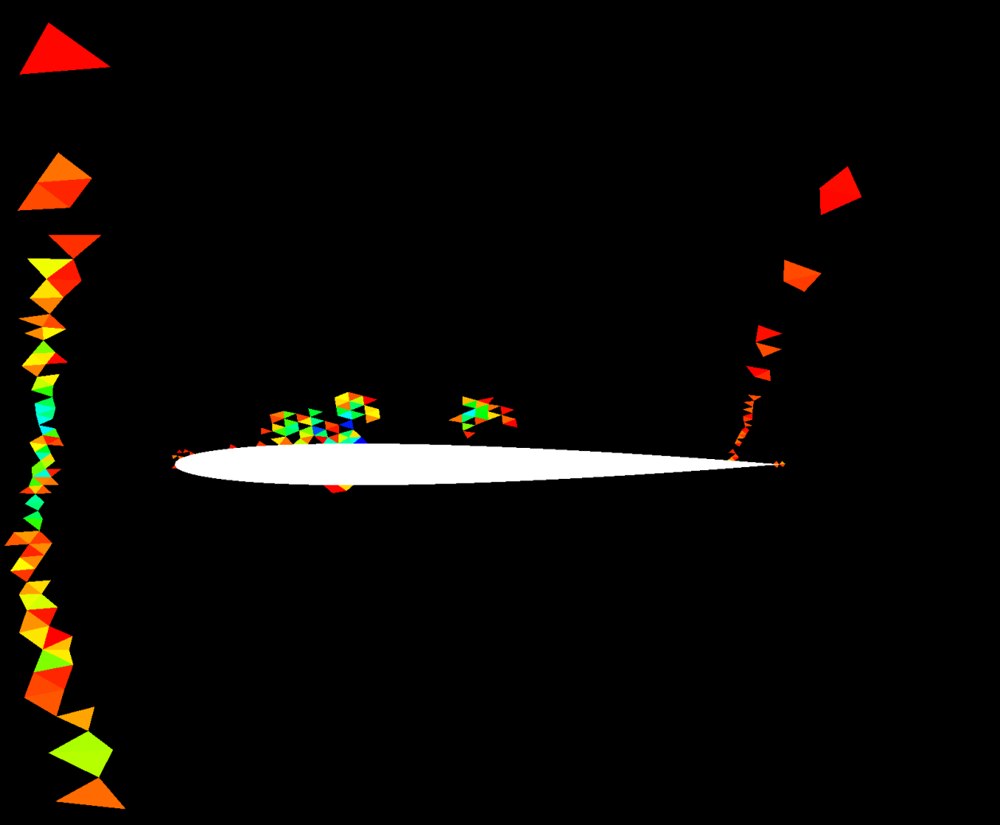

## Update: [9/21/21]

Update: I finished the shock finder, below is a plot of the "ShockFunction" (function 100) for the NACA0012 airfoil at M=0.8
on its way to becoming unstable. We can clearly see the shock function has picked up instability at the forming shock wave on
the trailing edge and at the curvature inflection on the top. We can also see the shock indicator tracking the startup
transient wave coming from the leading edge. It looks to be very effective, as reported! Next step - implement dissipation
for "troubled elements" to remove the instability.

After some research, I found a general pattern and one excellent summary from 
[Persson, et al](../research/filters_and_flux_limiters/PerssonPeraire_ShockCapturing.pdf)
describing how to capture shocks within the elements themselves while eliminating the aliasing oscillations.

Persson and Peraire demonstrated the following approach:
1) Isolate elements that are experiencing shock instability with a "shock finder"
2) Implement dissipation within only those elements to remove the unstable modes

For (1), they use the fact that in a smooth solution, the energy dissipates rapidly as the expansion order increases. They
form a moment, or inner product across each element that evaluates how much energy is present in the last expansion mode as a
ratio of total solution energy. Where this ratio exceeds a threshold, it indicates a lack of smoothness that identifies where
the "fix" is needed.

I'm currently working on calculating the shock finder from Persson, after which there are a variety of dissipation and/or
filtering approaches we can use, for instance the modified Barth / Jesperson filter used by 
[Zhiqiang He, et al](../research/filters_and_flux_limiters/Zhiqiang-He-Barth-Jesperson-limiter.pdf).

[Back to Index](../CHANGELOG-2D.md)
