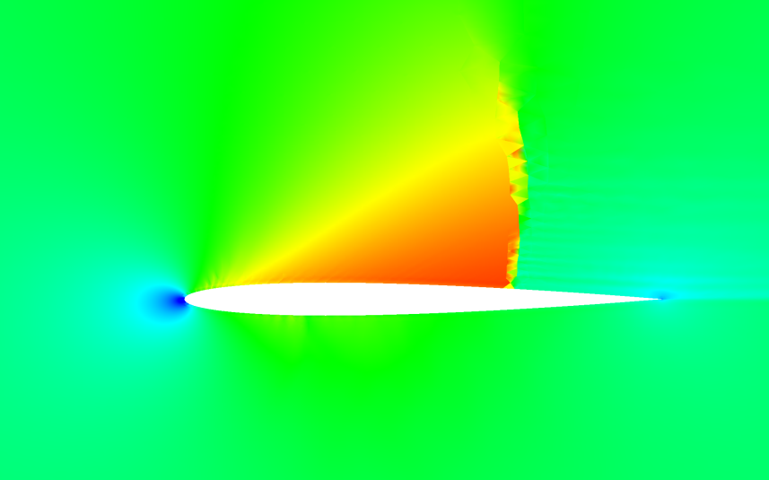

## Update: [10/26/21]

After fixing up the limiter and the epsilon artificial dissipation and doing some numerical studies with the shock tube
and airfoil, I'm convinced that the core flux/divergence scheme is a bit too "bouncy" as compared with other schemes.
The main issue with the limiter now is that there is "buzzing" around the shock wave, where the shock bounces back and
forth between neighoring cells, which stops convergence. There's one more thing I can do to make the limiter work better,
by filtering on characteristic variables instead of the conserved variables. This has been shown to focus the limiting
more where it's needed, and delivers a much cleaner result with less dissipation. I'll definitely implement that later,
but I think it's time for some core work first.

Given the success that Jameson and Romero experienced with their simplified DFR and when compared to the other DFR results,
it seems this current method is not as able to handle shock waves without significant Gauss instabilities. This has become
more clear when using the artificial dissipation approach, which *captures shock waves within a single element*, an
excellent feature that works now within this method. While in-element shock capturing works now, there are aphysical
extrema within the shock containing cells that Persson, et al did not experience. There are many excellent results with
the method so far, and it does seem close to complete and capable, so my question is: how can the current method core be
improved to fundamentally be better at handling shock waves?

After thinking about the above question, I think the answer may lie in the basis functions I've been using. The basis
functions define the modes energy has access to within the element, with various wave shapes that store energy. Though
Romero and Jameson used Lagrange Interpolating polynomials as their basis, I chose to use the Jacobi polynomials in a
tensor product as Hesthaven does in the book I've used for the core of this method. Basis functions have different
levels of variance from their mean, and my concern is that the Jacobi polynomials may be too "wild" when interpolating
to the element's extrema - specifically the interpolation of solution values to the edges.

|                 Jacobi Polynomials to N=9                 |                     Interval: -1 < X < 1                     |
|:---------------------------------------------------------:|:------------------------------------------------------------:|
|                     Alpha = Beta = 0                      |                     Alpha = Beta = -0.99                     |
|  |  |

In the above plot of the Jacobi polynomial in the interval -1 to 1, we can see what appears to be a collapse in the
values of the polynomials of all orders at the extrema of the interval. Intuition says we want to have all modes equally
available across the interval, and when we use the Alpha and Beta parameters to stretch the polynomials we can improve
the collapse as see in the plot on the right, although there is still quite a narrowing among modes. I tried running the
airfoil case using the basis on the right and it does seem to improve both convergence and extrema, but only marginally.

Up next: I'm implementing Lagrange Interpolating basis functions to the finite element construction as an alternative.
This will allow for comparison among basis functions and selection of the best for shock waves.

|      2nd Order, NACA 0012 Airfoil, Mach = 0.8, Alpha = 2 degrees      |                                    _                                    |                          _                          |
|:---------------------------------------------------------------------:|:-----------------------------------------------------------------------:|:---------------------------------------------------:|
| Artificial Dissipation, Intra Cell Shock Captured, Converged Solution |                   Same as left, with stretched basis                    |           Solution Limiter, Non-Converged           |
|                    |  |  |

[Back to Index](../CHANGELOG-2D.md)
