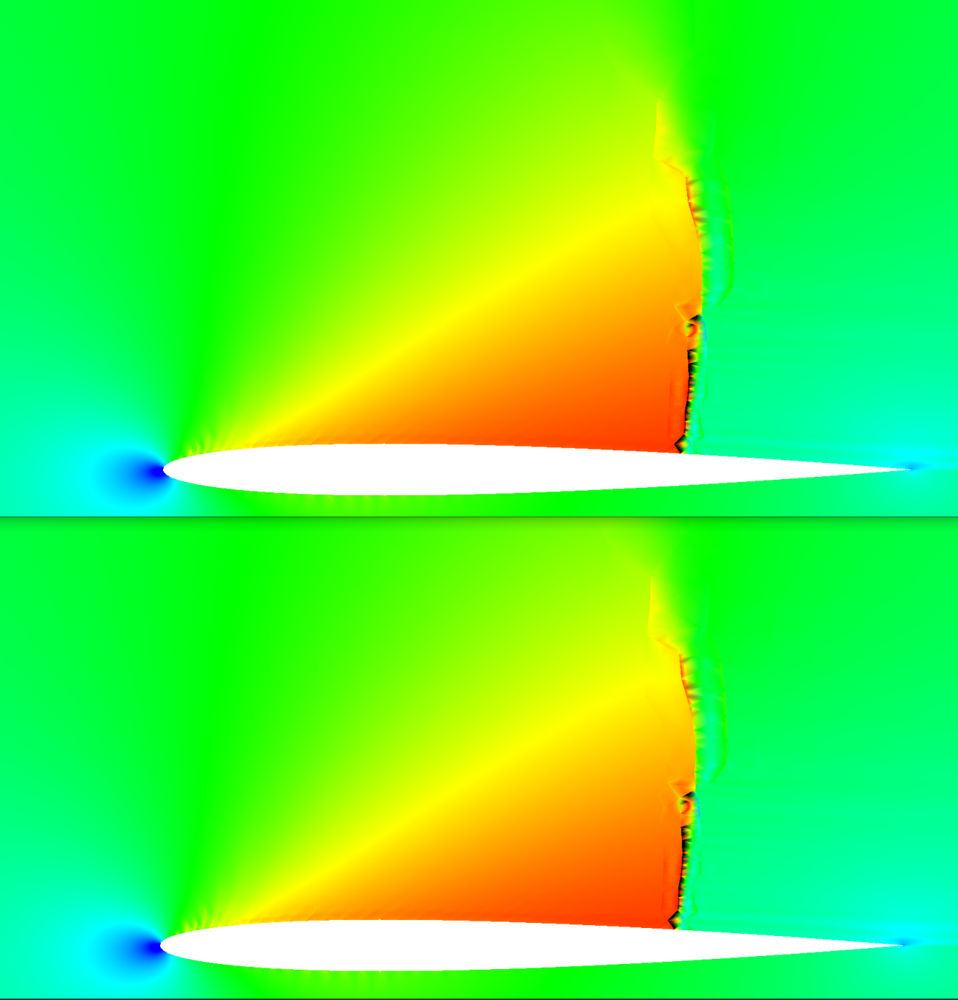
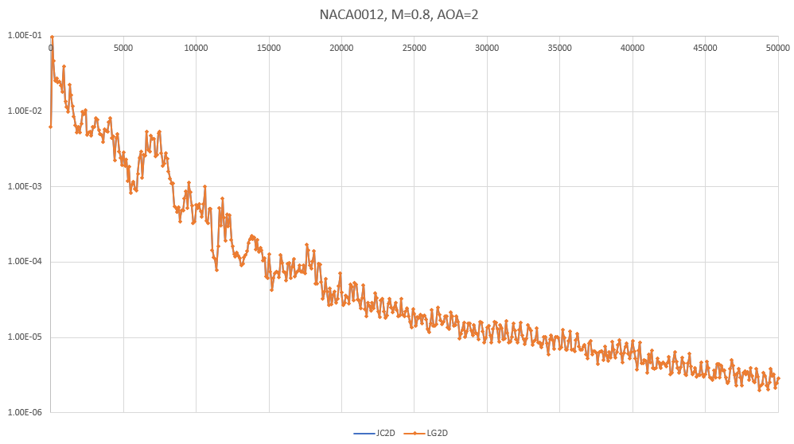

## Update: [11/5/21]

Next: I'm going to look into an exponential filter for the polynomial interpolation to the edges.

I've implemented a "true" 2D Lagrange polynomial basis for the scheme and now can compare results using the Jacobi Orthonormal
2D basis with the Lagrange 2D basis. Below are two cases run at second order, one using the Jacobi and the other the Lagrange
basis—they basically overplot each other, both in convergence history and in the final Mach number distributions.

Looking into this a bit—the Interpolation matrices for each basis are identical, as expected. As a result, the interpolation
from the solution nodes to the edges is the same between the two. The basis used for the divergence within the RT element is
different between the two, but that seems to not impact the results.

My conclusion based on this experiment: The interpolation to the edges appears to be more important to the solution than the
polynomial basis used in computing the divergence.

| NACA0012 M=0.8, AOA=2 Lagrange vs Jacobi Basis |               L2 Norm Convergence History                |
|:----------------------------------------------:|:--------------------------------------------------------:|
|                  Mach Number                   | Convergence, CFL = 3, Kappa = 3 (Artificial Dissipation) |
|        |      |

[Back to Index](../CHANGELOG-2D.md)
