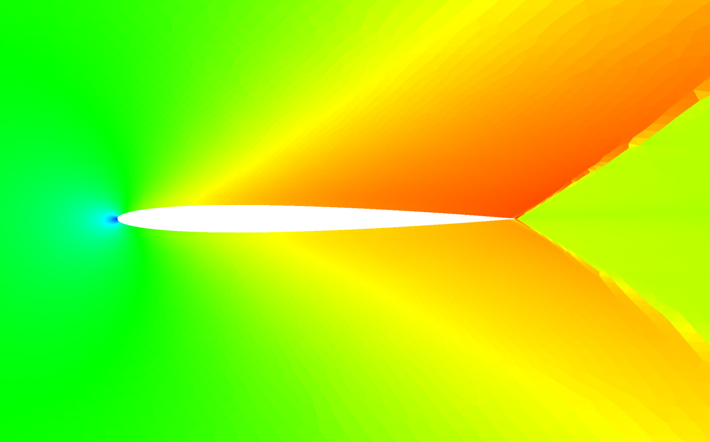
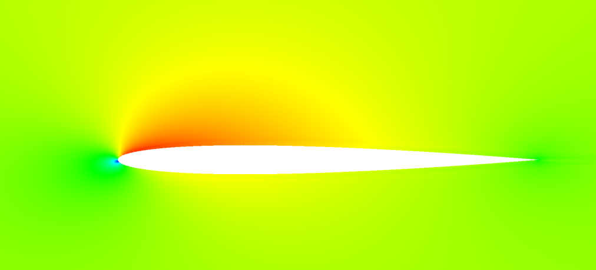
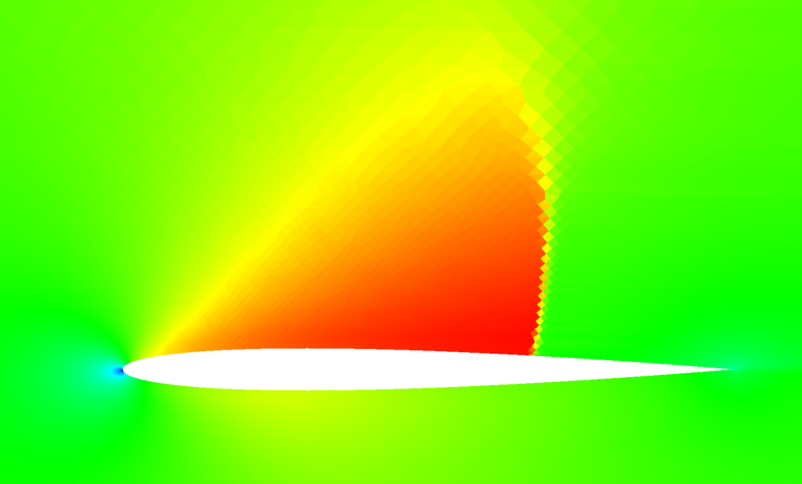

## Update: [11/28/21]

I've now continued testing and transonic cases are also working for P!=1. What's interesting now is that for P=0,
the transonic solutions and shock tube solutions are wiggle free / monotone. Below is a transonic airfoil solution at
Mach = 1.0 and 0.8, converged, on a mesh with 42,500 elements. The shock wave is finely resolved and is monotone. The convergence
was also far more monotone and rapid than the higher order solutions.

The biggest difference between the 0th order solutions and higher order is the interpolation of the flux from the interior
nodes. In the P=0 case, there is only one interior point and the flux is simply copied from the interior to the edge, as
is typical of second order finite volume schemes. Reconstruction of the shared flux value at the edge is then handled via
solving the 1D normal Riemann problem at the edge at first order. The resulting scheme should converge at 1st order, or
P+1.

I think at this point, the wiggle problem I'm experiencing is due to the non-monotonicity of the interpolation of the flux.
New extrema are being created, and my instinct is to eliminate the extrema by limiting the interpolated values to the min
and max of the values in the interior. This would remove "extrapolation artifacts", but what is the impact on numerical
accuracy?

| P=0, NACA 0012, Mach = 1.0, Alpha = 2, Interpolated Flux, Converged |
|:-------------------------------------------------------------------:|
|                        |

| P=2, NACA 0012, Mach = 0.5, Alpha = 2, Interpolated Flux, Converged |     P=0, Mach = 0.8, Fine Mesh, Converged     |
|:-------------------------------------------------------------------:|:---------------------------------------------:|
|                            |  |

[Back to Index](../CHANGELOG-2D.md)
