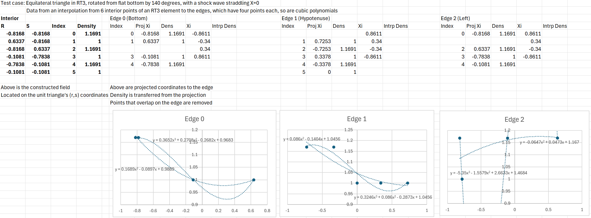

# Shock Capturing experiments on RT element

## Test case: Single element with centered shock wave

In order to isolate the effects of interpolation on simulated fields, I've 
set up a single element with a shock wave centered on it. The element in 
real space is an equilateral triangle, with some rotation angle left as a 
parameter. Initially, we have no skew included, it's a fixed shape rotated 
about its center. A shock wave is set up at X=0 so that the pre and post shock
values straddle the element.

## Wild variations occur when interpolating to edges, even with mild shocks

Even with a Mach 1.2 normal shock wave, we get extreme oscillations when 
interpolating field values from the interior points to the edges. This is 
certainly the cause of the unstable solutions seen in practice.

## Instead of using 2D interpolation, trying out Edge Projection

Spatial projection of the 2D values to the edge is apparently a common 
technique used in Finite Element analysis methods. The projected locations 
are used to do a least squares fit on the edge basis polynomial in 1D, which 
allows for more control over the stability and match to the RT element basis.

A couple of problems need to be solved - it's often the case in doing these 
projections that the projected locations can be quite close together or even 
colocated on the edge, so we have to filter the projected points to 
determine how many will be used to perform the interpolation to the edge 
basis. I've used a heuristic that when two points are colocated, we keep the 
one closest to the edge and discard the other, which allows us to create a 
proper interpolation problem.

Another problem is now evident: the spatial collapse of values to the edge 
can make the shock jump values show near infinite slope if the projected 
values on the edge are too close together. This creates a wild polynomial 
fit, which is back to the problem we're seeking to solve with the 2D fit. A 
visual analysis of the problem shows the issue on edge 2 prominently, where 
the cubic polynomial fit goes wild: 

It's clear from the analysis of the cubic fits that the coefficients of the 
fit at the highest order have become large relative to the lower orders, so 
we could use a modal filter to recognize this effect, and filter out the 
higher orders to get a better fit. This is simulated in the analysis by the 
2nd order fits, which are well behaved. Removing one of the points when it 
is too close to another is another possibility, but that leaves an open 
parameter WRT proximity.

## Next steps: refine the edge projection approach, investigate modal filter

Edge projection is showing some promise in enabling finer control of the 
interpolation process. As next steps I'm going to investigate modal 
filtering of the 1D interpolations, but I'll also see how the edge 
projection approach compares with modal filtering of the 2D interpolation 
operation. If we implement recognition of the case when the high order modes 
are "spilling over" for the 2D interpolation, it might be sufficient and in 
many ways superior to the dimensional reduction experienced when projecting 
to the edge.