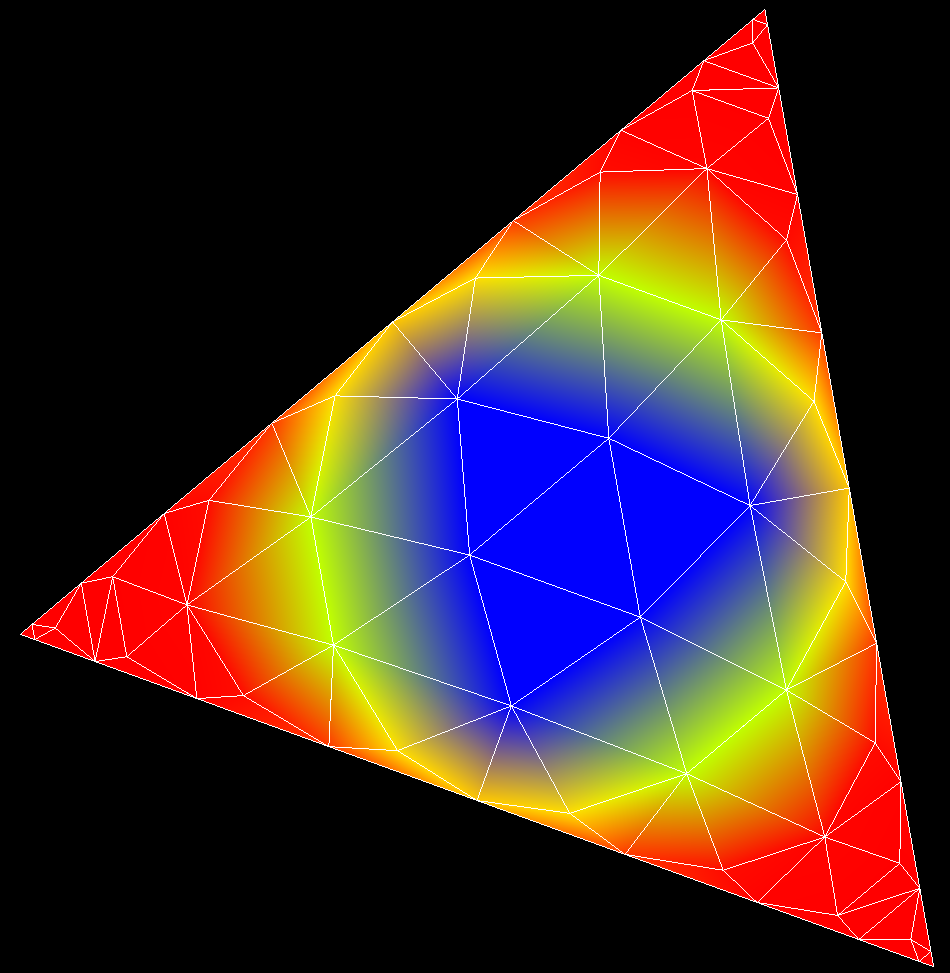

# Shock Capturing experiments on RT element (part 2)

## Test case: Single element with isentropic vortex, etc

Below is the density field for an isentropic vortex centered on (0,0) with 
the element rotated 140 degrees about the centroid. The element is an RT7.

I replaced the prior delaunay triangulation with a golang API wrapped on the C 
"triangle" library, which fixed a bug with order 4 element triangulation in 
this project. That was causing the inability to support runs with P=3 and 
some other orders, which won't happen anymore - yay!

## Next Steps: Focusing on 2D polynomial interpolation with exponential damping

I'm planning to simulate an attenuated shock wave that would look similar to 
a shock captured by the method using Persson dissipation. With this in place,
I'll test methods to damp the interpolation such that a TVD principle is 
held - no new minima or maxima will be created. The concern with this is 
that in smooth regions, new minima and maxima should be allowed, such as the 
case of the isentropic vortex, so I'll be testing the damping mechanism and 
shock finder to ensure that we don't smear smooth fields with the damped 
interpolation.