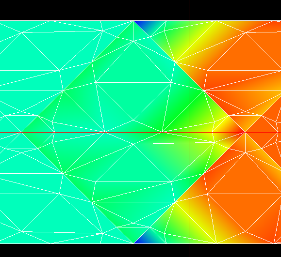

# Shock Capturing - Modulating Edge Interpolation

## The remaining problem: Edge interpolation is unstable with shocks

In the interior of elements, shocks are nicely distributed across the interior
polynomial. The artificial dissipation is enabling modulation of the shock in
the interior effectively, in a manner similar to what has been reported in
others who use the Persson dissipation approach. We can get stable and 
convergent solutions for the wedge case at orders up to 4, but the NACA 0012
airfoil transonic case goes unstable at the foot of the shock wave when the 
shock approaches Mach 2.5+ during transients. 

In the supersonic Wedge case, where a shock crosses an element we see the edge
extrapolations get wild when the shock crosses near the vertex of a triangle at
the opposing edge. The instability we continue to see is caused by this 
extreme behavior of the interpolation in the presence of the shocks.

The next focus is on reducing the extent of the gibbs oscillations in the 
interpolated edge values. We're going back over familiar territory of WENO 
type schemes that seek to minimize extrema when composing the flux at 
element boundaries. Previous efforts in this project include:
- Galerkin projection to reduce element order from P to P=0, then use the 
  single value for the edges (equivalent to using the mean)
- Polynomial mode clipping - dropping the higher order modes in the 
  interior polynomial using an exponential filter
- Nearest neighbor point interpolation - use interior points close to the 
  edge nodes for reconstruction.

In the next sprint on this effort, I'm focusing on approaches that extend 
the artificial dissipation used in the interior to the flux reconstruction 
at the edges. I believe that the interior polynomial has been "tamed" by the 
dissipation, but the interpolation of that tamed polynomial to the edges 
needs to be governed by a similar process.

## Shock indicator scaling experiments

| Four Elements with Modulated Edge Interpolation |
|-------------------------------------------------|
| )                |

The above elements intersected by the vertical red line have a normal shock wave
solution imposed with Mach 5 on left and a normal shock at the line and post
shock on the right. The Persson shock indicator is calculated, then used to
modulate the interpolation of the interior polynomial to the edges according to:

        Q_Interpolated =
            alpha * Q_Interpolated + (1-alpha) * Q_Mean
        alpha = exp(-Beta * sigma)
            sigma is the shock indicator
            Beta is a constant, around 3.->10.

In the above, the shock indicator smoothly increases from 0 when a shock is 
found inside of a cell. When no shock is present, alpha is 1. and the full
interpolation is used and when a shock is found, the interpolation is moved
toward the element mean.

I've tested the above modulation and it doesn't work to stabilize the solution
in practice. The observed solution has increased extrema when the modulation 
is applied, possibly due to over constraint of the interior as used to 
connect to other elements. Another possible issue is that the shock 
indicator is not C0 continuous among elements, as is the epsilon viscoscity 
in the Persson artificial dissipation, so neighboring elements might be 
experiencing discontinuous modulation, which is destabilizing.

## Survey of existing research

I prompted ChatGPT to research available literature on this topic - after 
some back and forth, this was the prompt: "Dubiner at P-1, RT at P, minimize 
variation - ideally no new extrema, specifically for handling 
discontinuities that create aphysical extrema when the dubiner basis values 
are sampled at the edges of the triangle for use in computing flux for the rt
basis"

Summary of Techniques and Formulations

In summary, several mathematical strategies have been developed to project
high-order DG solutions to enriched spaces (like RT) without creating
nonphysical oscillations:

    ENO and least-variation extensions: Choose the extension to order $P$ 
    that minimizes oscillation. ENO schemes achieve this by selecting the 
    smoothest stencil/polynomial, avoiding crossing discontinuities
    ntrs.nasa.gov.
    . This yields a polynomial with minimal variation from the lower-order one
    arc.aiaa.org
    . In multi-D, this can be done on each face or by multi-dimensional
    smoothness indicators. These methods aim to extrapolate with least
    variation, thereby sidestepping new extrema.

    Monotonicity-Preserving limiters: Impose a no new extrema condition by
    limiting polynomial coefficients. Examples include TVD/TVB slope limiters,
    moment limiters, and the Monotonicity-Preserving (MP) interface 
    reconstruction of Suresh-Huynh ntrs.nasa.gov
    . These ensure sharp yet non-oscillatory transitions at discontinuities by
    modifying the polynomial near jumps. The limiter may use neighbor data to 
    cap the polynomial’s values at interfaces, ensuring the projected RT 
    solution remains bounded by the original solution’s range.

    Harmonic or variational projections: Compute the new polynomial by solving
    a minimization problem (e.g. minimize $\int |\nabla (u_P)|^2$) or a 
    Laplace equation with appropriate constraints. The resulting harmonic 
    extension is the smoothest possible interpolant and by the maximum 
    principle will not generate new extrema sciencedirect.com
    . This approach directly targets variation minimization in a continuous
    sense and can be implemented as a filter or a penalty in the projection.

    Optimization-based constrained projection: Formulate the DG-to-RT mapping
    as a constrained optimization (often quadratic programming). For example, 
    Bochev et al. enforce mass conservation and bound-preserving constraints 
    while minimizing deviation from the original high-order solution cnls.lanl.gov
    . Such methods systematically handle discontinuities by finding the
    best-fit RT polynomial that lies in the feasible monotonic set. They 
    guarantee no new aphysical extrema by construction of the constraints, and 
    often can be solved with efficient algorithms (decomposing into 
    element-wise or face-wise problems for locality).

Each of these techniques has a firm basis in the numerical PDE/FEM literature.
In high-order discontinuous Galerkin (DG) and mixed finite element methods,
combinations of these ideas are used to ensure stability. For instance, a
modern high-order CFD scheme might use a hybrid approach: a troubled-cell
indicator flags an element with a steep gradient; then a hierarchical limiter
(variation of minmod) is applied to its Dubiner coefficients to enforce
monotonicity; if further needed, an optimization-based flux corrector adjusts
the face flux in the RT space to clamp any remaining oscillation. By carefully
designing these projections and limiters, one attains a high-order accurate
solution that is free of spurious oscillation, even across strong
discontinuities.

References: High-quality sources detailing these approaches include:

    Harten et al. (1987) on ENO schemes (minimal oscillation stencil selection).

    Suresh & Huynh (JCP 1997) on monotonicity-preserving polynomial limiting (MP schemes)
    ntrs.nasa.gov.

    Xu & Shu (2005) and others on WENO limiters for DG on unstructured grids.

    Krivodonova (2007, JCP) on limiting strategies for DG in multi-d.

    Persson & Peraire (2006, AIAA) on artificial viscosity for DG (variational smoothness indicator)
    upcommons.upc.edu.

    Zhang & Shu (2010, JCP) on maximum-principle-preserving DG schemes (positivity as a subset of monotonicity).

    Bochev et al. (2012, JCP) on optimization-based bound-preserving remap
    cnls.lanl.gov.

    Kuzmin (2010, IJNMF) on algebraic FCT for high-order finite elements.

    Guermond et al. (2018, JCP) on invariant-domain (convex) limiting for high-order schemes.

These works collectively provide the mathematical formulations (e.g. inequality
constraints for no new extrema, objective functions for least variation) and
practical algorithms to achieve least-variation, monotonicity-preserving
projection from a Dubiner basis to a Raviart–Thomas basis or similar high-order
function spaces. Each approach balances accuracy and oscillation-control in
different ways, but all recognize the importance of preventing unphysical
oscillations when dealing with high-order representations of discontinuous
solutions.

