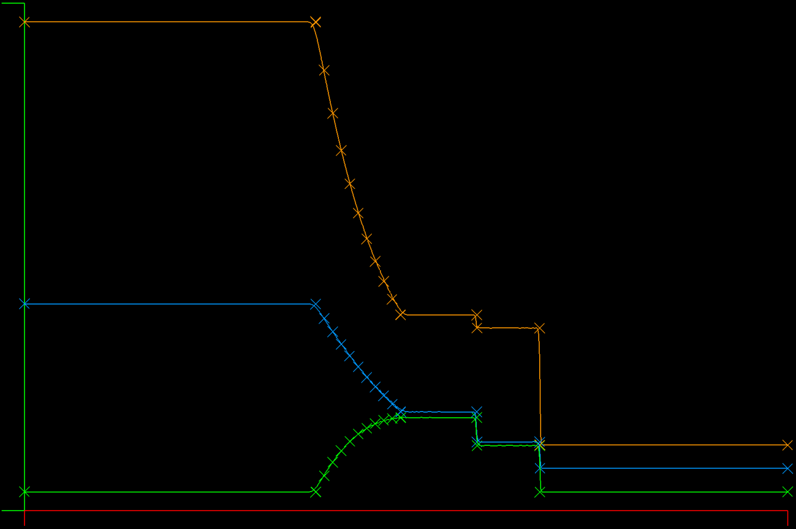

## Update: June 9, 2020):

Success! I reworked the DFR solver and now have verified optimal (N+1) convergence on the Euler equations for a density wave (smooth solution). The convergence orders for N=2 through N=6 are:
```
DFR Integration, Lax Friedrichs Flux
Order = 2, convergence order = 2.971
Order = 3, convergence order = 3.326
Order = 4, convergence order = 4.906
Order = 5, convergence order = 5.692
#Affected by machine zero
Order = 6, convergence order = 3.994

DFR Integration, Roe Flux
Order = 2, convergence order = 2.900
Order = 3, convergence order = 3.342
Order = 4, convergence order = 4.888
Order = 5, convergence order = 5.657
#Affected by machine zero
Order = 6, convergence order = 4.003
```
Note that:
1) No limiter is used on the smooth solution
2) Odd orders converge at something less than the optimal rate
3) Even orders converge at approximately N+1 as reported elsewhere

I've noticed dispersion errors in the odd order solutions for the SOD shock tube when using a limiter - the shock speed is wrong. I'm not sure what causes the odd orders to behave so differently at this point. The difference in convergence rate between even and odd orders suggests there may be a material issue/phenomenon for odd orders, though I haven't found anything different (like a bug) in the process, which leads to a question about the algorithm and odd orders. One thing to think about: Even orders put a solution point in the center of each element, while odd orders do not...

At this point I feel confident that I'm able to move on to multiple dimensions with this approach. I'll definitely need to implement a different and/or augmented limiter approach for solutions with discontinuities, likely to involve a "shock finder" approach that only uses the limiter in regions that need it for stability.

A note on the refactored DFR approach: In the refactored DFR, an N+2 basis is used for the flux that uses (N+3) Legendre-Gauss-Lobato (LGL) points, which include the edges of each element. The solution points use a Gauss basis for the element, which does not include the edge points, and there are (N+1) interior points for the solution. At each solver step, the edge points of the solution are interpolated from the (N+1) solution points to the edges of the (N+3) flux basis and then the flux is computed from the solution primitive variables. The derivative of the flux is then computed on the (N+3) points to form the solution RHS components used in the (N+1) solution. The result is that the flux is a polynomial of order (N), and so is the solution.

Below is:
```
Euler Equations in 1 Dimension
Solving Sod's Shock Tube
Algorithm: DFR Integration, Roe Flux
Solution is limited using SlopeLimit
CFL =   2.5000, Polynomial Degree N = 8 (1 is linear), Num Elements K = 2000

SOD Shock Location = 0.6753
Rho Integration Check: Exact = 0.5625, Model = 0.5625, Log10 Error = -4.3576
case,K,N,CFL,Log10_Rho_rms,Log10_Rhou_rms,Log10_e_rms,Log10_rho_max,Log10_rhou_max,Log10_e_max
"DFR Integration, Roe Flux",2000,8,2.5000,-2.6913,-2.7635,-2.2407,-1.7183,-1.6491,-1.1754
```



[Back to Index](../CHANGELOG.md)
