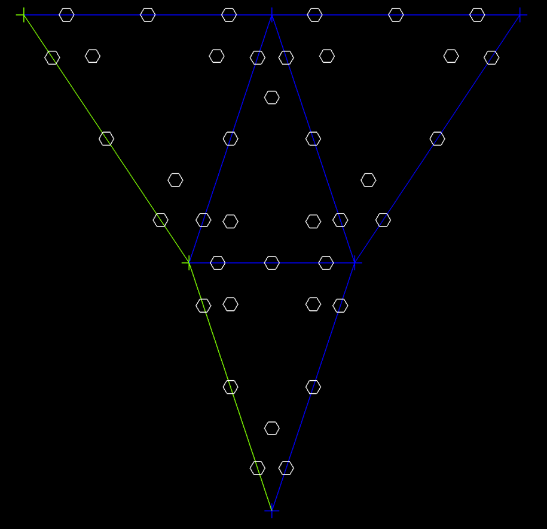

## Update: Oct 2 2020):
Up next: I'm working on initializing the 2D DFR solution method. My plan is to construct a separate structure containing
all faces so that we can iterate through the face structure to construct the fluxes on each face only once. Each face is
shared by two elements, and each face has a complex and expensive flux construction that unifies the computed values from
each element into a single flux shared by both. By constructing a dedicated group of faces, we can iterate through them in
parallel to do that construction without duplication. The shared flux values will be placed directly into the flux storage
locations (part of the RT element) so that the divergence can be calculated to advance the solution.

Above we see three elements and within each are the interior solution points and along the edges/faces are the flux points
for Order = 1. Each RT element has 12 points, 3 on each face and three interior, while the three Order 1 solution points are
in the interior.

I've implemented a Delaunay triangulation that converts 2D point fields with fixed boundaries into a triangle mesh. The
picture shows the RT7 element triangulated using the method. Now we can use the triangulation within the reference element
to implement contour tracing and other graphics to display the field contents within the high order elements. This approach
requires that we triangulate only the reference element, then we use that triangulation to fill the insides of the triangles
in the mesh (using the affine transform).

I'm adding a contour plotting capability that will provide display of functions within the model. The approach I'm favoring
is to triangulate the points within the full RT element, including the vertices, which will enable the plotting of the
interpolated solution values used for the edge flux definitions in addition to the interior solution points.

The triangulated mesh containing vertices, the interior solution points and the edge flux points is then used for a linear
contour algorithm to produce the isolines for the whole mesh. The resulting isoline field is a linearized view of the
polynomials, but is sampled at the full resolution of the polynomial basis at N+1, which should provide an accurate
representation of the solution field, though not at the same polynomial order. This should be very useful for visually
characterizing the interpolation to the flux points on edges and other attributes of the solution process, in addition to
showing actual solutions with high fidelity.

[Back to Index](../CHANGELOG.md)
