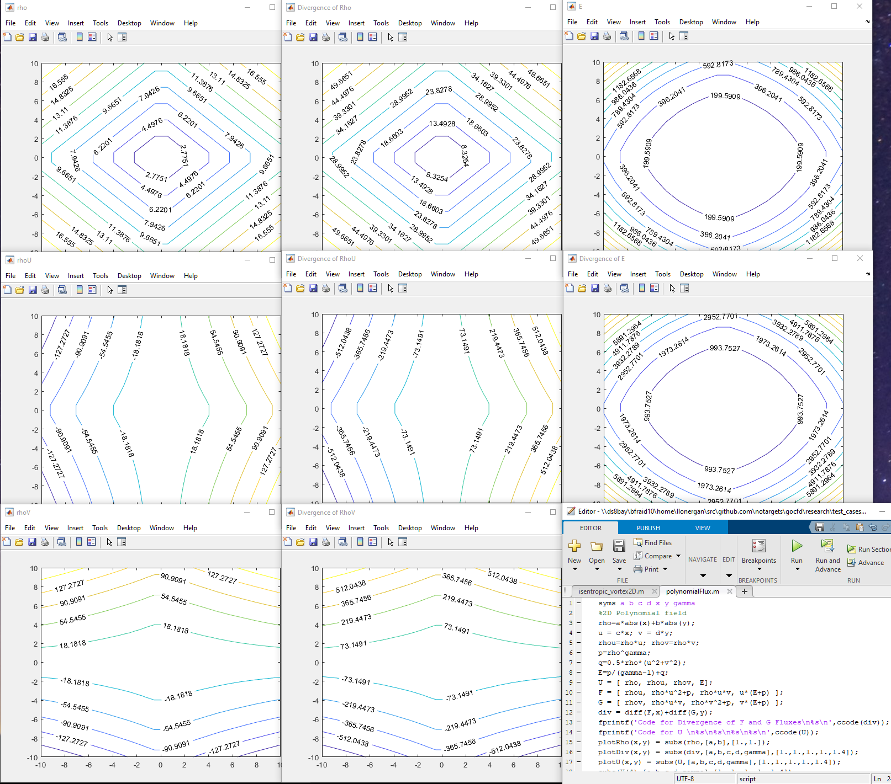

## Update: Nov 9 2020):

Testing the calculation of divergence using an exact polynomial flux field calculated in Matlab. It seems there's a bug
involving the indexing or process using the full transformed calculation with edge computations because the divergence is
nearly exact for the first element (k=0) and the mass equation divergence, but deviates for other elements and equations.
It's very useful at this point to verify the accuracy of the divergence operator because the bulk of the solver relies on
this one operator, and so we can characterize the accuracy (and stability) of the algorithm almost entirely by evaluating
the divergence.

Above we see the polynomial flux field in a series of graphs for each equation in the conservative variables and the
resulting divergence for each equation. All values are real, not complex and appear smooth (and thus differentiable!).

[Back to Index](../CHANGELOG.md)
