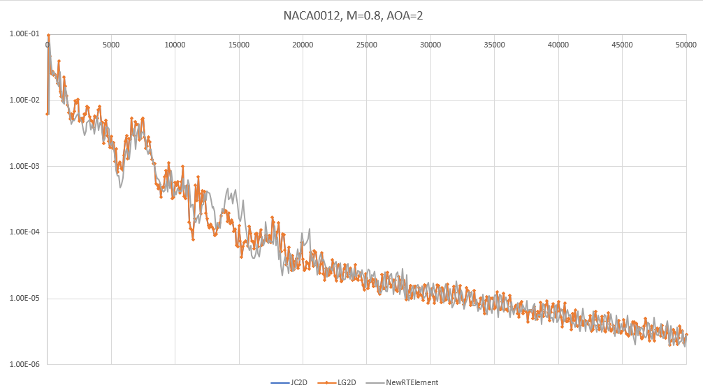

## Update: [11/9/21]

| NACA0012 M=0.8, AOA=2 New RT Element vs Lagrange Basis vs Jacobi Basis |
|:----------------------------------------------------------------------:|
|                        L2 Convergence Compared                         |
|                                       |

The results are in—a completely new Raviart-Thomas element design is now available, and it gives results
that are very similar to the prior implementation. It's hard to judge which is superior, but at this point, the new basis
requires a slightly higher artificial dissipation for the airfoil case and seems to achieve similar convergence rates. The
"wiggles" in the shock tube case are still present. Mostly, I'd say the results prove that the RT element basis is not
responsible for the general instability with shocks. The "good news" here—after re-designing and replacing the core of the DFR
method, we get very similar results, which gives new confidence that the DFR core is likely correct. New theory: it's the
interpolation of the solution values to the edges that is the culprit—instead, I'll interpolate the flux from the solution
points to the edge along with the solution values, then compose the Roe flux as an average of the interpolated L/R fluxes plus
terms arising from the interpolated solution values for the Riemann problem at the edge.

I see a/the problem now! The current build of the RT element used for divergence is incorrect, or at least is different from
other constructions in a fundamental way. There are two polynomial domains included in the RT element, one is a 2D vector
polynomial field `\[Pk\]^2`, and the other is a 2D scalar polynomial multiplied by the vector location `[X](Pk)`. These are
allocated to the interior points and to the edges separately.

I had chosen to use a 2D polynomial basis of degree "P," the same degree as the RT element to implement the basis functions
for edges and interior. I multiplied the edge functions by `[X]` and used the highest-order basis functions for the edges,
left over after consuming basis for the interior points.

Now, after reviewing [V.J. Ervin, "Computational Bases for RTk and BDMk on
Triangles"](../research/convergence_and_fluxes/DFR/computational-bases-for-RTk-and-BDMk-on-triangles.pdf), I believe the
RT element basis he constructed is superior and that mine likely has some asymmetries that may be producing the "wiggles."

I'm now working on a revised RT element basis, following Ervin's design.

[Back to Index](../CHANGELOG.md)
