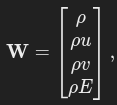
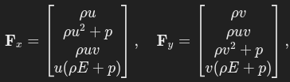
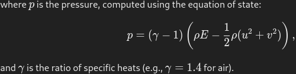
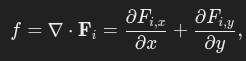
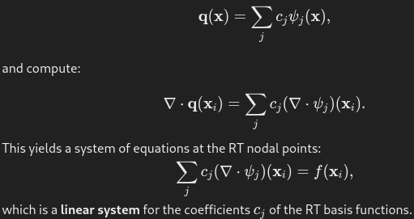

# Restatement of Numerical Method: Hybrid Elements to Represent Scalar Field and  Coupled Vector Flux Field

## Background

After implementing an Euler equations solver using a combination of scalar 
simplex finite elements and vector simplex Raviart Thomas (RT) elements 
according to the Direct Flux Reconstruction (DFR) approach described by Romero
and Jameson, I've seen a lot of issues with Gibbs phenomenon at shock waves on 
simple reference problems. I've focused on various methods to suppress the 
Gibbs phenomena including limiters and artificial dissipation, but the 
problem is still severe.

After some time away from the project, I re-assessed the methods used and 
have realized that I missed a key point about the nature of the numerical 
method having to do with the relationship between the scalar element and the 
RT element. It's fundamental to the DFR approach, and defines the mechanism 
by which the scalar field solution is used to compose the vector flux field 
on the RT element, which likely is causing many problems with the accuracy 
of the method.

## Method Formulation: Hybrid Scalar and RT Vector Elements For Euler Flux

### Euler Flux, Scalar Quantities

Scalar flux in the Euler equations is the Divergence of the conservative 
variables being convected in the X and Y directions. The conservative 
variables W are:

The vector flux {Fx, Fy} isn't simply the product of the velocity vector 
with the scalar quantities, except for the mass equation. Mass is convected 
purely via velocity, but the momentum and energy equations feature a 
pressure term for the flux. This is the embodiment of the physics of the 
problem we are solving, so we compute the flux vectors using the physical 
definitions:

The scalar flux (f) is the scalar value obtained by computing the divergence of 
the flux, which is the dot product of the Del operator with the Vector Flux:

### Discontinuous Galerkin and Why Use a Hybrid Element Scheme

The RT element has a vector field that is used in this case to represent the 
Euler Flux. Why use the RT element? For Discontinuous Galerkin elements, we 
need to couple neighbor elements together somehow. The DFR method uses the 
flux vectors at element boundaries to establish connections by using the 
physics of characteristic convection to tie the flux of neighboring elements 
together by solving a Riemann problem for each pair of boundary elements to 
determine how the flux is propagated. A value of flux is calculated for each 
neighbor at the same boundary node, then the fluxes are corrected to take 
into account the physical propagation of properties using the wave 
propagation mechanics, often using a Roe Flux Averaging scheme or similar.

The RT element is very useful in one principal way: it enables the 
interpolation of interior scalar field values to the edges where we do the 
coupling in a way that preserves the conservation law physics properties.

### Scalar and Vector Elements Coupled Via the Divergence Relationship

The primary mechanism by which the two types of elements are related is the
equality between the divergence of the vector flux to the scalar flux. Given 
that the flux field is represented as bolded "q" and the scalar flux field 
is represented as "f", the equality is:

We have that the divergence of the vector flux field is equal to the scalar 
flux at all nodal points of the RT element. Here's the critical process we 
use for the computation: we solve the physics equations on the scalar 
element using differential equations solution approaches that calculate 
divergence, etc. At each solution "step", we need to get the values of 
vector flux at the element boundaries, and we use the above relationship to 
compute those flux values directly.

What is implied by this solution approach is that we have to get the values 
of the scalar field at the points of the RT element. Given that the scalar 
element is of lower order than the RT element (Scalar is order P, RT is 
order (P+1)), this means we either have to interpolate the scalar values to 
the RT node points, or we have to "project" them, which involves solving an 
ill posed weak integral equation. The simplest approach is to interpolate 
the scalar field values to the RT element's node points, which is made 
easier by the fact that the RT element's interior node points can be (are) 
colocated with the RT element's interior node points.

### Obtaining the Flux at the Element Boundary

The algorithm for obtaining the flux at the element boundaries:
1) Interpolate scalar field values to all RT nodal points from the scalar 
   element
2) Compute the scalar flux "f" at each of these nodes by evaluating the 
   partial derivative in the X and Y directions of the Fx and Fy vectors and 
   adding the result to produce a single scalar value at each of the RT 
   nodes. This is done using the differentiation of the scalar basis functions
3) Solve for the coefficients of the RT basis functions that correspond to 
   these values of scalar flux, which provides the vector flux field that is 
   consistent with the RT element

The equation used to solve for the coefficients of the RT element is the 
same euqation shown previously, with the substitution of the basis functions 
and coefficients for "q":

Now that we have the coefficients of the RT vector field, we can use the 
flux values along the element edges to couple neighboring elements together 
by solving the Riemann problem on each pair of neighbor edge node points. 
Note that on the edges, the coefficients of the RT nodes are numerically 
equal to the flux normal to the edge boundary, which is exactly what we need 
to solve the Riemann problem, along with scalar conservation values, which 
we have from the previous steps.

### Calculating Divergence within the Numerical Solution Approach

When we solve the Euler (or Navier Stokes) equations, we need to calculate 
divergence of the vector flux field. Note that in the preceding discussion, 
we have two versions of that presented. We can use the scalar element to 
compute divergence by first order derivatives, or we can use the RT element 
to compute divergence using the vector flux values we went to much trouble 
to compute. In the DFR method, we've constructed vector flux values in the 
RT element space, and we've corrected the flux to represent connection to 
neighbor elements. Now that we have corrected fluxes in the RT space, we 
need to use the RT element to compute the divergence, which is then injected 
into the scalar element's interior node points, as they are colocated with 
the interior node points of the RT element.

This hybrid scheme provides a way to interpolate vector flux conservatively, 
couple the flux values between neighbors, calculate the resulting divergence 
and advance the scalar solution.