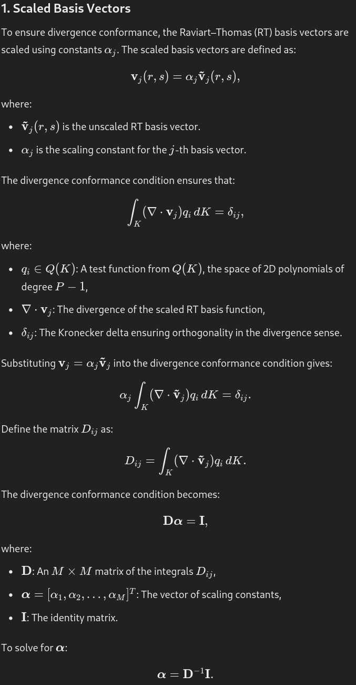
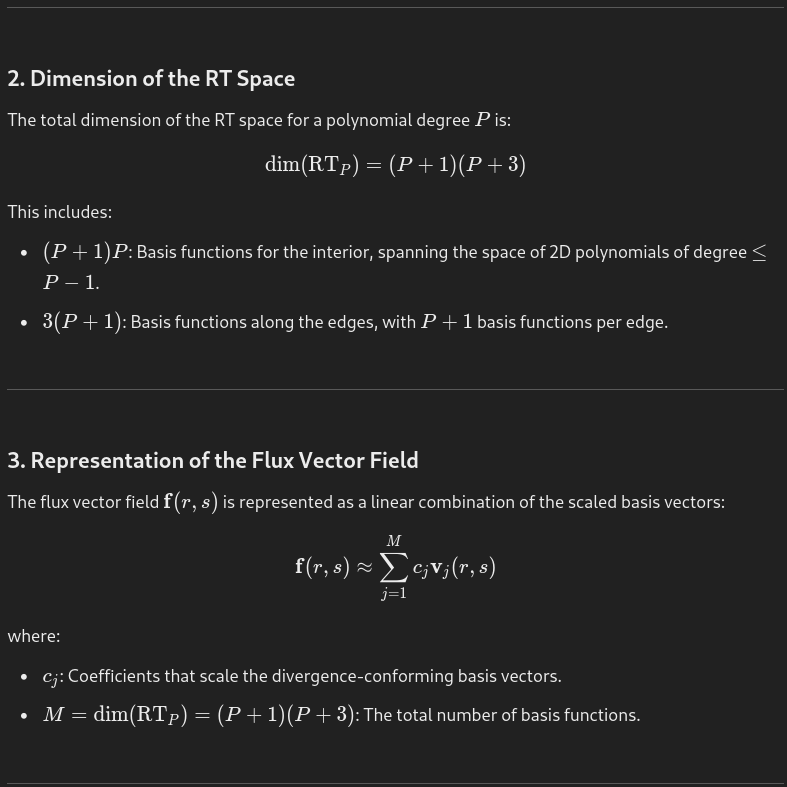
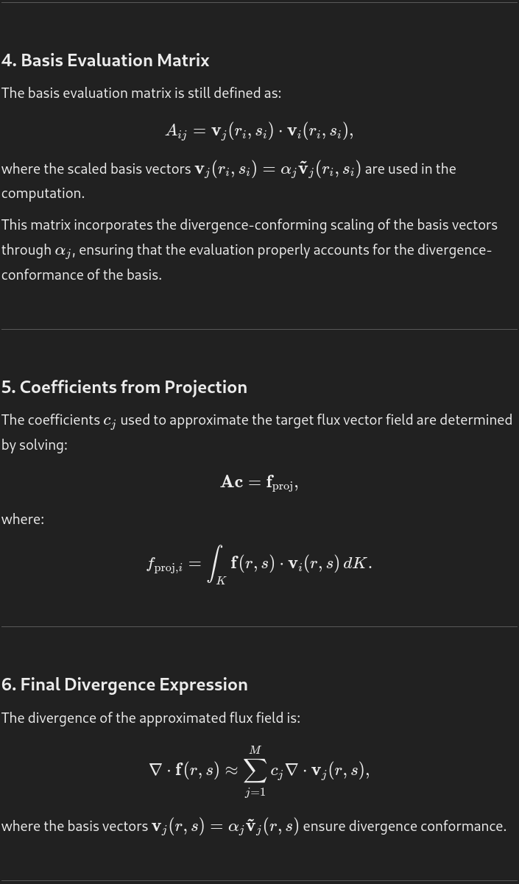

# Redefinition of the Raviart Thomas Element Construction (Part 2)

There's additional information needed to complete the RT basis, specifically,
the below conditions must be met. Also, a comment on the conditions 
expressed in update 47: the interior polynomials must vanish when the dot 
product of each interior polynomial is taken with each edge function. Rather 
than simply zeroing out their contributions in the evaluation matrix as 
stated previously, we compose the vector basis functions to have this 
behavior intrinsically. This requires that we use both the R and S 
directions of each basis function to be able to meet this condition.

The paper
[computational-bases-for-RTk-and-BDMk-on-triangles](../research/convergence_and_fluxes/DFR/computational-bases-for-RTk-and-BDMk-on-triangles.pdf)
provides a comprehensive set of basis functions that are compliant. While 
the last revision of the RT element done here attempted to implement that 
paper's approach, there are some parts of the implementation that need 
correction, and in addition we want to ensure compatibility between the 
polynomial basis used for the solution points and that used by the RT 
element. Specifically, we want to use the Jacobi polynomials for the RT 
element instead of Lagrange polynomials to ensure the orthogonality and 
spatial characteristics of the Hesthaven elements.

