# Shock Capturing experiments on RT element (part 3)

## Next steps: Reconstruct flux directly using FV sub-element triangulation

The below results from using the modal filter to suppress Gibbs oscillations in
the interpolation of solution values from the interior show complete failure 
of the interpolation approach for reconstruction of edge fluxes. It's obvious
now that there is no reasonable chance for interpolation to function correctly
when discontinuities are present. The Gibbs oscillations are too prevalent and
can't be filtered away on the high modes of the polynomial.

During these experiments, I noticed that the sub-element triangulation I'm using
for graphics contains all of the information needed to construct an order P
flux at the edge. If we simply use the opposing interior nodal values along
the neighbor sub-edges to construct sub-face Roe fluxes, then integrate those
along the edge with the P faces we have, we get an order P flux along the edge.
Given that this is a well understood sub-problem for each sub-face, we know
with certainty that the reconstructed flux will be well behaved. On reflection,
this now seems so obvious that I fully expect this is what others are doing
in practice and they're just not talking about it.

Below is a visualization of the RT1-RT8 elements showing the interior points 
(in green crosshairs), the edge segments in white along with their 
associated triangulation, and the element boundary in red. It's clear from 
these graphics that the edge segments are well supported by interior points 
that we can use to reconstruct flux on the edge segments. This represents 
the unit triangle, and every element will mirror these interior points 
across each edge segment, forming the basis for each Riemann solution to get 
the flux on the edge segment. We then area average each pair of edge 
segment's Roe flux on either side of each RT edge node to get the flux for 
that edge node. This should be both stable and accurate for all 
circumstances, as the order of the reconstruction should match the order of 
the edge, which is P+1, even though each reconstruction is 1st order across 
the edge.

| RT1                        | RT2                        | RT3                        | RT4                        |
|----------------------------|----------------------------|----------------------------|----------------------------|
| 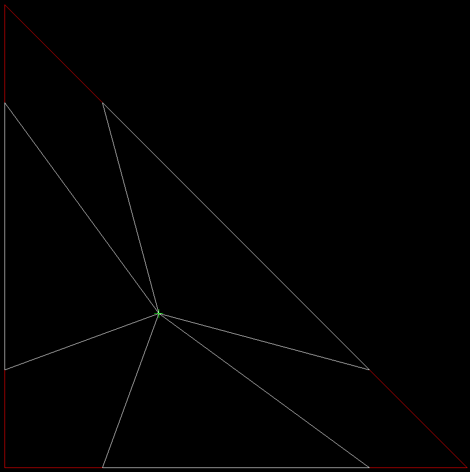 | 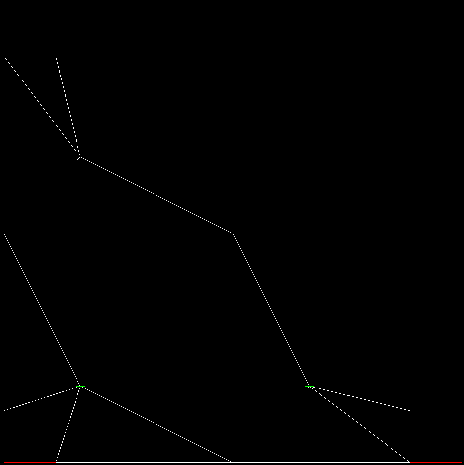 | 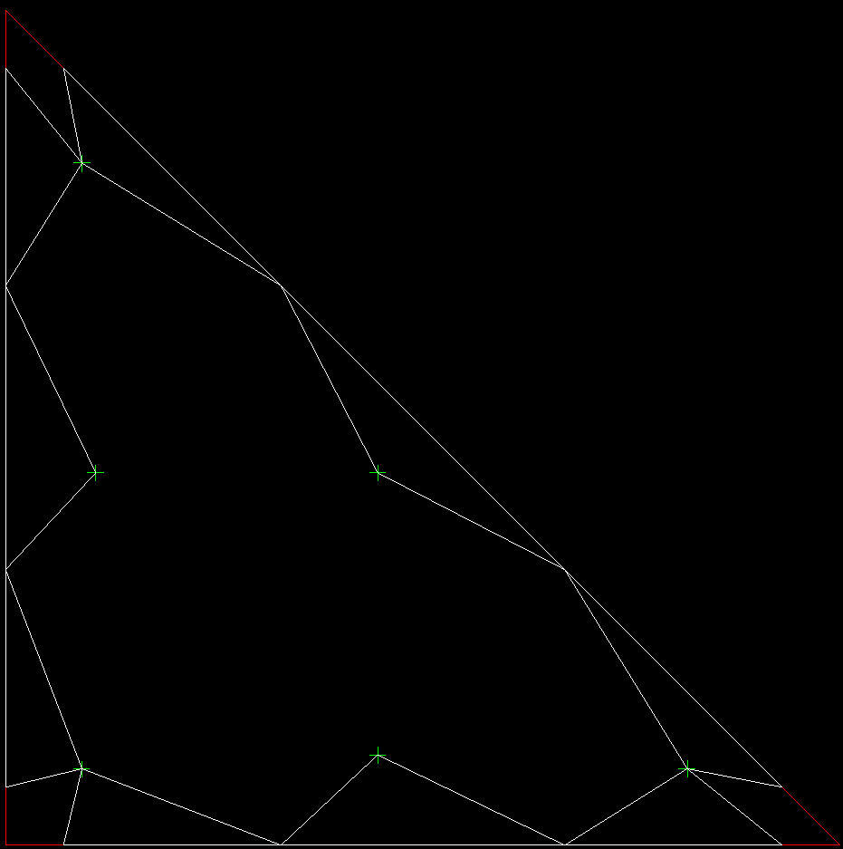 | 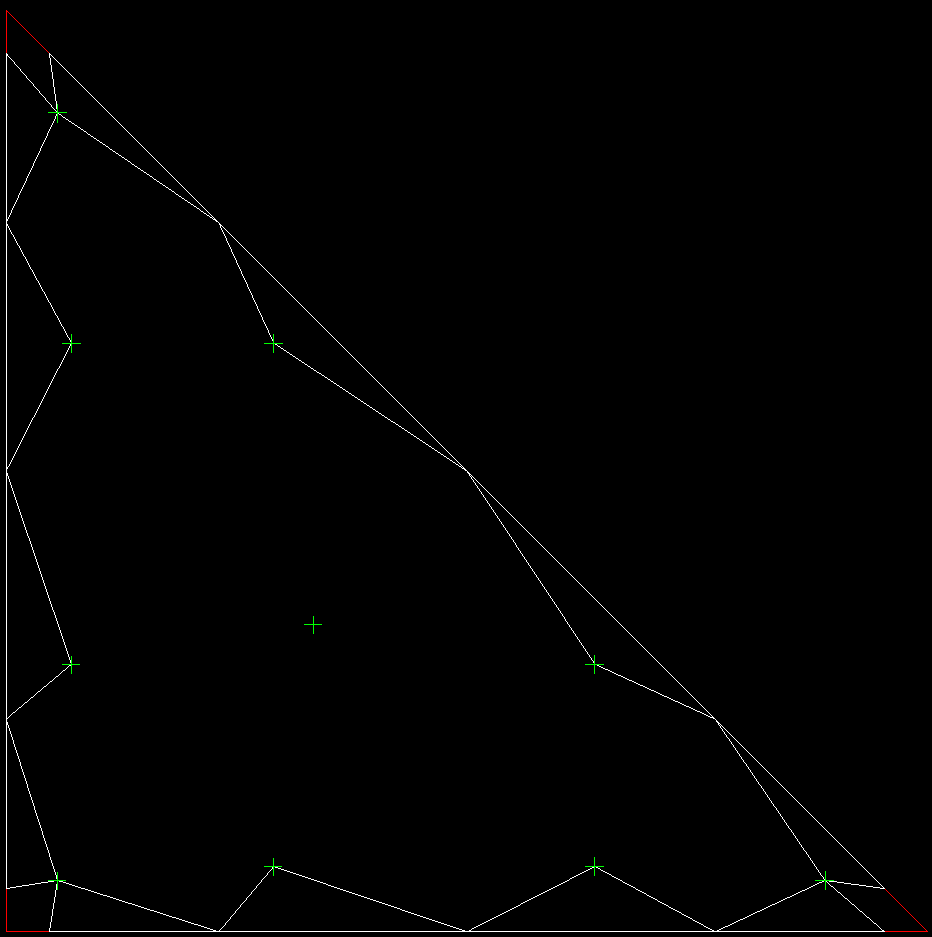 |

| RT5                        | RT6                        | RT7                        | RT8                        |
|----------------------------|----------------------------|----------------------------|----------------------------|
| 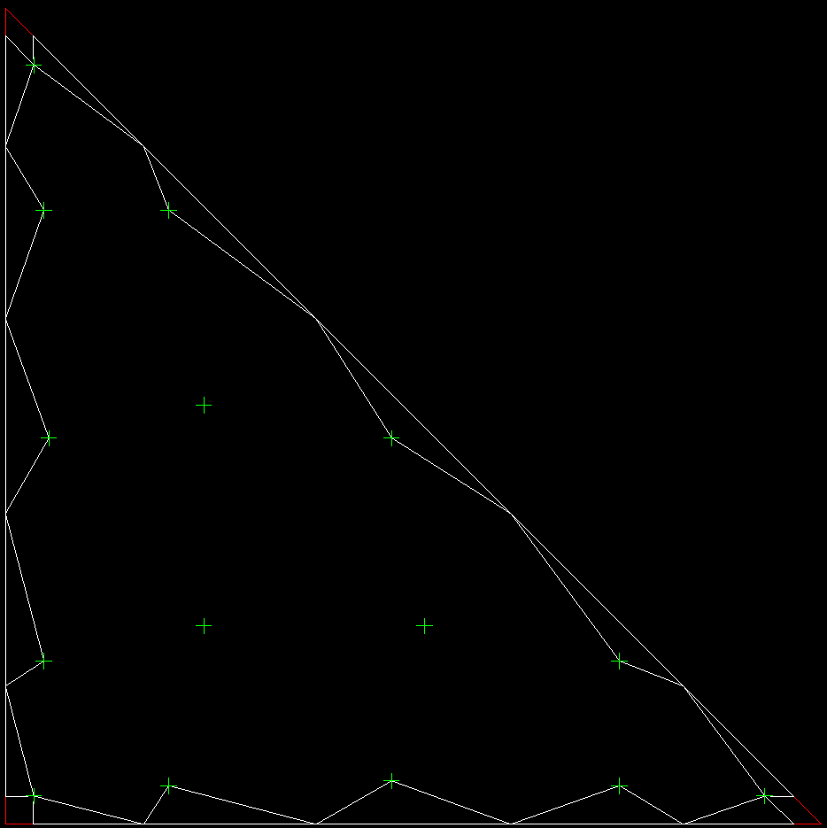 | 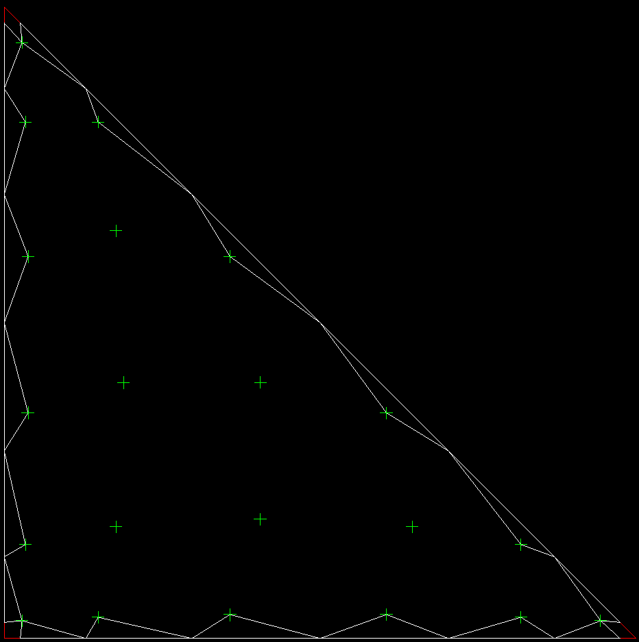 | 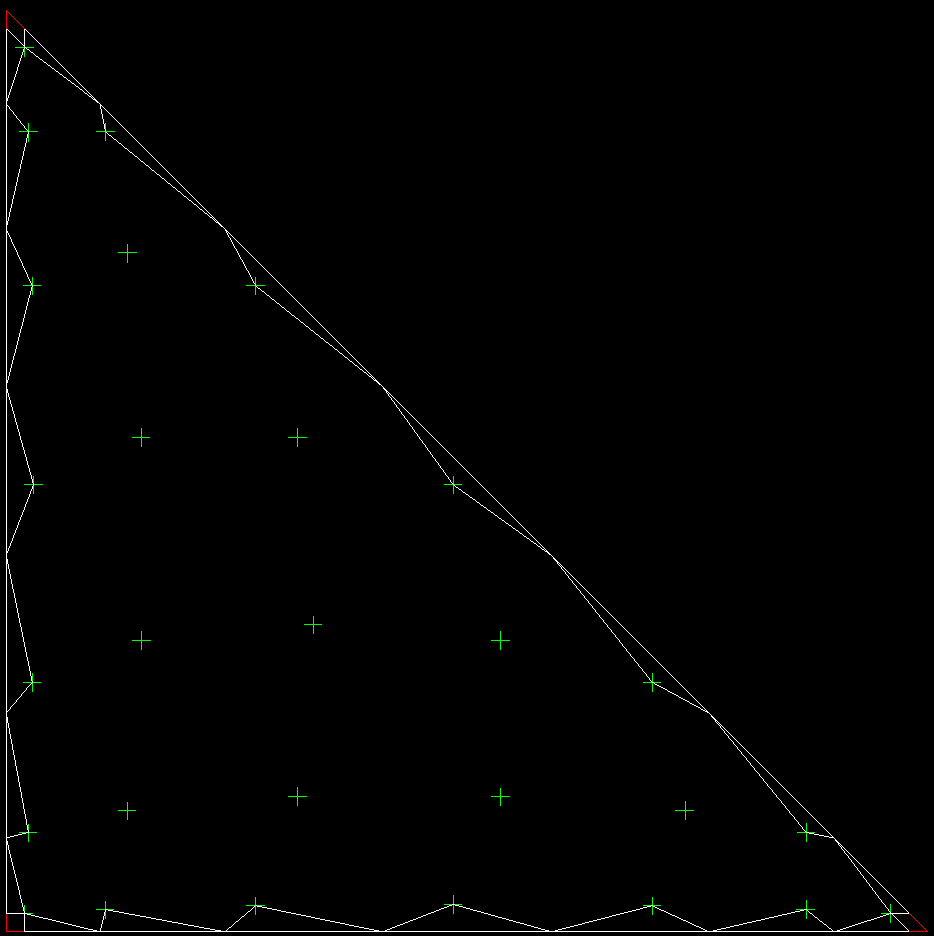 | 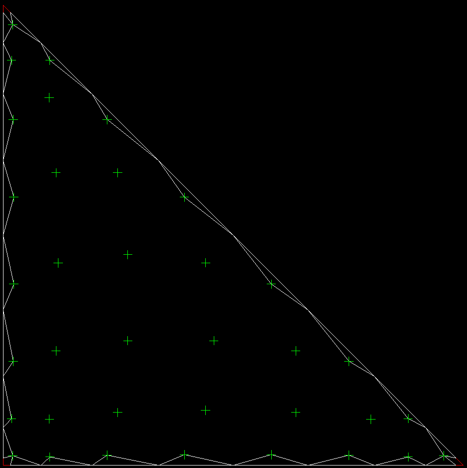 |

## Experimental Results: Modulating filter is not enough (not even close)

The deciding factor is: how effective is the approach for a case where we have
an existing shock wave in the field. This is analogous to a shock tube
experiment, where we have a discontinuity as an initial condition. If the
method is incapable of handling the initial condition for realistic flows,
it can't be expected to properly handle transients either.

In the test cases below, we have an isentropic vortex, which is a smooth, but
gradient filled flow. Then we have shock waves, Mach 1.2, 2.0 and 5.0. What
is shown is the density field on a ten element setup, where the interior
nodes defining the polynomial field have been set to the accurate values of
the field, then the edges are interpolated from the interior using the 
polynomial basis, just as would be the case with the DFR solver.

What is clear from these results is that the interpolation is well behaved and 
accurate for the vortex, but goes completely out of bounds for the shock waves.
The second picture of each case shows the results of applying a modal filter to 
the polynomial so that the high order modes most responsible for the Gibbs
oscillations are suppressed. The modulation effect is hardly noticeable on the
shock waves, though the numerical values show a small reduction in extrema.

I also experimented with application of the modal filter to the interior nodes,
and it did produce a more significant effect, but no where near what is needed
to suppress the oscillations.

Isentropic Vortex - Interior fMin: 0.368005, fMax: 0.996771  

| Without Modal Filter | With Modal Filter |
|----------------------|------------------|
| **Interpolated fMin: 0.3605, fMax: 0.9988** | **Interpolated fMin: 0.3604, fMax: 0.9986** |
| 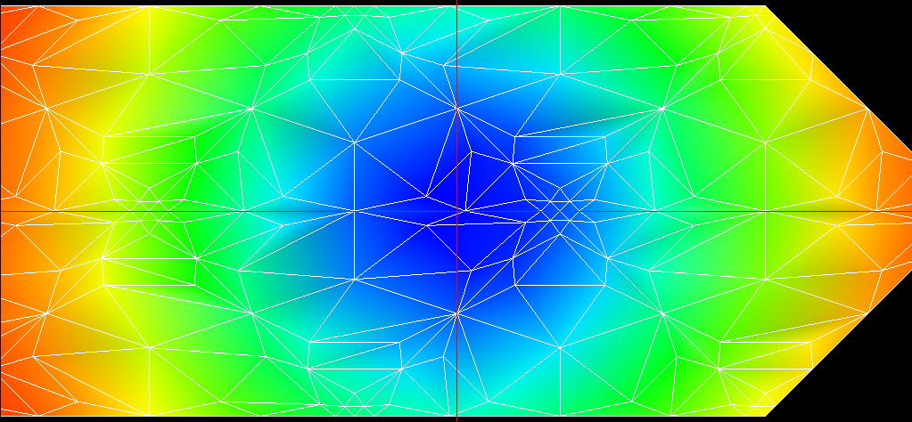 |  |

Mach 1.2 Shock Wave - Interior fMin: 1.000000, fMax: 1.023697

| Without Modal Filter | With Modal Filter |
|----------------------|------------------|
| **Interpolated fMin: 0.9843, fMax: 1.0394** | **Interpolated fMin: 0.9851, fMax: 1.0392** |
| 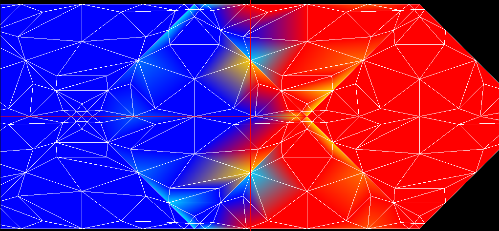 | 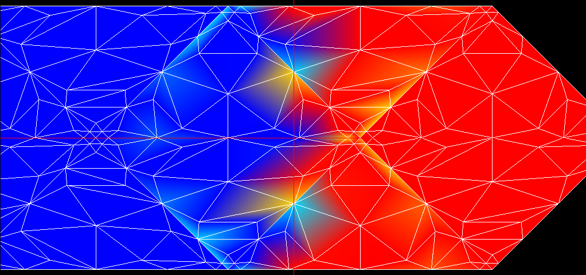 |

Mach 2 Shock Wave - fMin: 1.000000, fMax: 2.181818

| Without Modal Filter | With Modal Filter |
|----------------------|------------------|
| **Interpolated fMin: 0.2187, fMax: 2.9631** | **Interpolated fMin: 0.2578, fMax: 2.9562** |
| 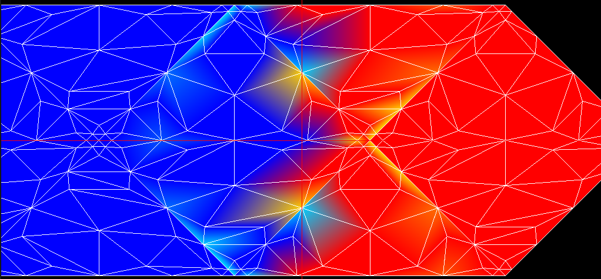 | 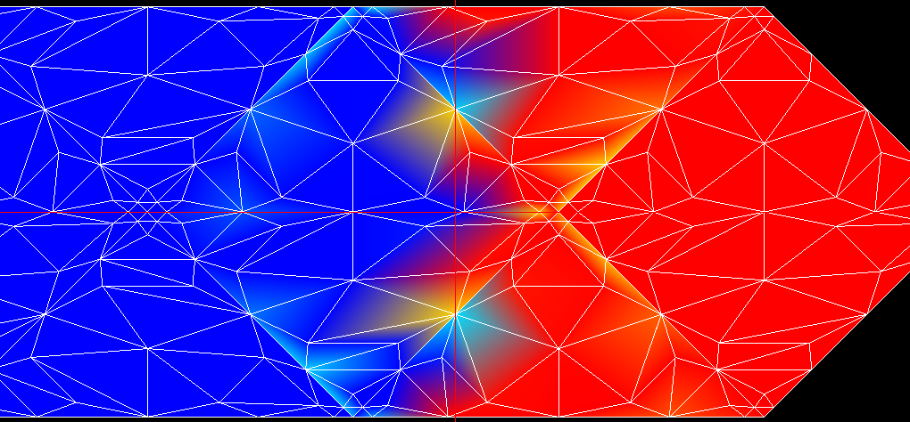 |

Mach 5 Shock Wave - fMin: 1.000000, fMax: 4.687500

| Without Modal Filter | With Modal Filter |
|----------------------|------------------|
| **Interpolated fMin: -1.4378, fMax: 7.1252** | **Interpolated fMin: -1.3159, fMax: 7.1038** |
| 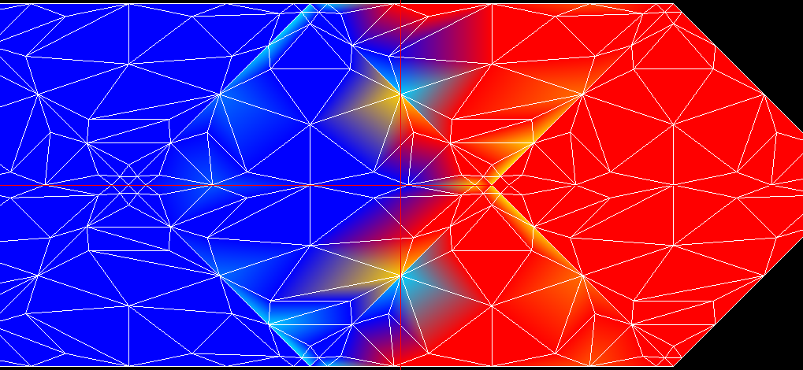 | 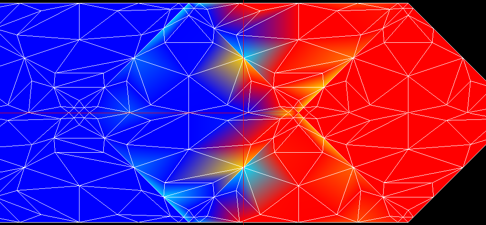 |
