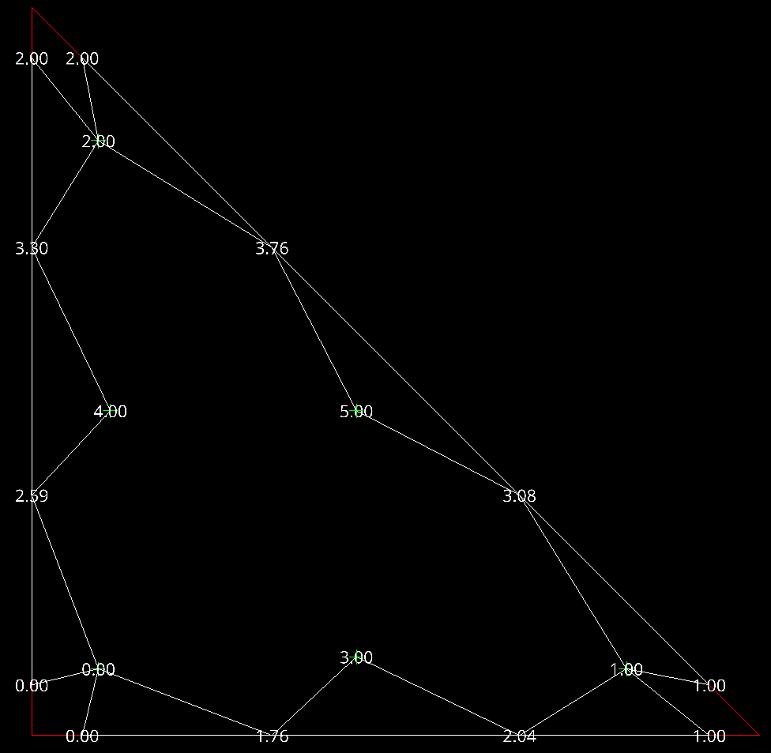
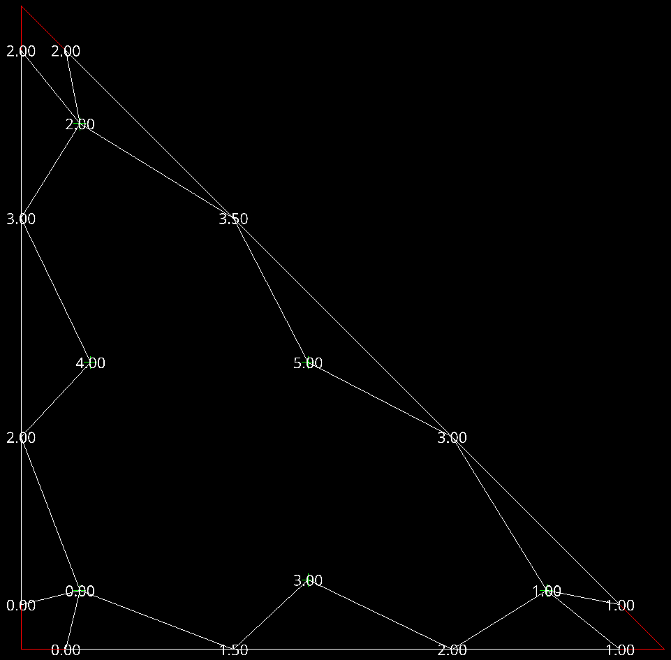

# Shock Capturing experiments on RT element (part 4)

## Sub-element simple projection

Below are two choices in how to project interior values to edges: area averaging
and simple averaging for an RT3 element with six interior points. The 
interior points in the example are provided sequential values and the edges 
are averaged from the neighboring interior values using either the included 
area of that interior node's triangulation edge span or a simple average.

| Area Averaged                                                                | Simple Average             |
|------------------------------------------------------------------------------|----------------------------|
| ) | |

Early experiments with the supersonic Wedge using this edge projection for 
only cells that have shocks in them shows a reduction in stability when 
using area averaging and even worse stability using simple averaging. The 
excursions move to the interior nodes in the vicinity of shock waves.

To figure out whether the averaging itself was problematic, I enabled the 
same projection for all cells, not just shocked cells. I obtained stable 
results for P=1, but in analyzing the unstable results for P=2 it is clear 
that instabilities start in the cell interiors near the walls and shock 
waves, but are more pronounced near the walls. There are also small 
instabilities present in the P=1 case near the walls, and so we can conclude 
that the suppression of the interior polynomial modes in the edge 
projections seems to be producing a compensating reaction in the interior 
polynomials of the cells.

## Next steps: Dimension reduction and orthogonal spatial projection

On inspection of these interior nodes adjacent to the edge nodes, we can see 
that we have a nicely associated set of P points from the interior that are 
adjacent to the P+1 points on each edge. We can construct a P-1 polynomial 
along each edge using an orthogonal spatial projection of the interior node 
values that will be nicely spaced along each edge. The solution in the 
interior is of order P-1 (the RT element is one order higher), so this is 
actually coincident with the notion of extending solution values at their 
correct order to the boundary. We can think of it as extending a trace of 
the 2D polynomial solution to the boundary, almost like a camera shot of the 
interior projected to the edge.

My concern with this approach is that we will still expect some of the Gibbs 
phenomenon in the projection because the P-1 1D polynomial will encompass 
the large variation due to the shock. I do expect the severity of the 
excursions to be much reduced compared to the 2D extrapolation of values 
from the full interior. As such, this seems like a valid way to preserve the 
polynomial nature of the interior while reducing the severity of the excursions.