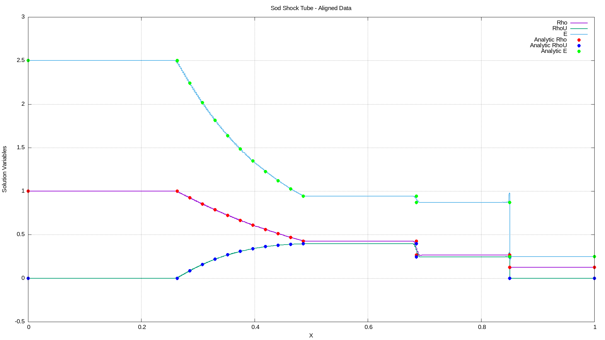
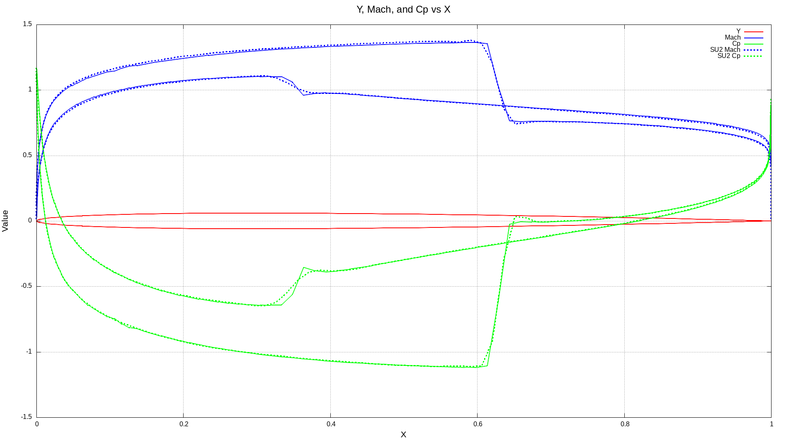
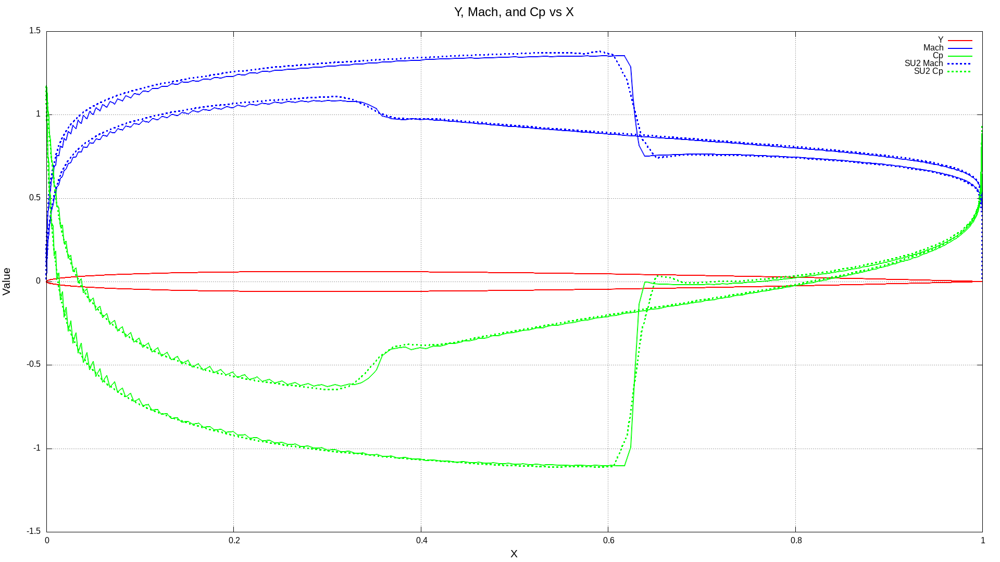
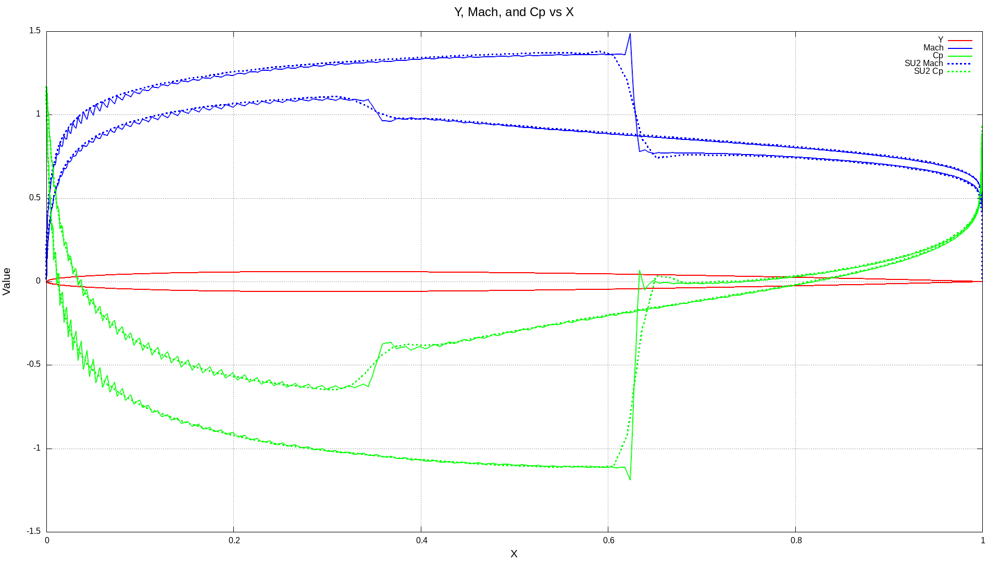

# Final successful conclusion for 2D Euler solver - comparison to SU2

## The 2D Euler solver is complete and as good as it can get

The Direct Flux Reconstruction (DFR) method is now fully tested here in 2D 
and we can conclude as Jameson and Romero did that the method is stable up 
to order 4, but not beyond. They also concluded that the method is very 
sensitive to the edge point distribution, which I've also verified through 
optimization of edge point placement.

I now believe that the fundamental issue holding the DFR method back is the 
interpolation between the order P solution polynomial and the order P+1 flux 
polynomial carried by the Raviart Thomas element. This hybrid arrangement 
has a lot of advantages, namely that the computation of the divergence of 
flux does not require a matrix multiplication of order P^2 x Kelements, 
instead it's linear in order because we compute the divergence directly 
using the basis of the RT element, which gives us order P x Kelements. 
Unfortunately, this hybrid also causes aliasing issues when interpolating 
between the order P field and the edges of the P+1 field, which are 
unsurmountable beyond order 4 in 2D and maybe beyond order 3 in 3D.

## Next Steps: 3D Solver using FR and Split Entropy Flux

I'm going to move to implement a 3D solver using a different geometric 
modeling technique using colocated flux and solution polynomials. This will 
avoid the aliasing problems associated with the DFR method, as both the flux 
and solution are of the same order P. These methods have been successfully 
employed with 3D tetrahedra by Persson and others at orders beyond P=4 in 3D,
so we should be able to implement Large Eddy Simulation turbulence modeling 
without limitations.

The Split Entropy flux formulation splits the physical fluxes into two 
components using a chain rule decomposition. This promotes the ability to 
build an entropy stable solution method on the Navier Stokes equations so 
that we don't introduce entropy artificially in the numerical solution. This 
is important both in turbulence modeling and in shock capture.

For shock capture in the entropy stable method, we'll likely introduce 
artificial dissipation as we do here in 2D, and we'll have to be careful as 
we interact with turbulence production physics.

In the planned 3D solver, I'll implement it first for the Euler equations as 
we did here. I plan to implement a GPU compatible solver with full surface 
halo construction, which should simplify the structure of the solver, making 
it easier to read. I've been unhappy with this 2D solver's edge construction,
as it's overly complicated and is biased too much toward saving memory at 
the expense of extensibility to GPU and high parallelism.

The new solver should be much faster, much more stable and should be easier 
to make quick progress. However, the CFL numbers achievable in 3D will be 
reduced by at least a factor of 1/Sqrt(3) for pure dimensionality reasons. I 
expect to implement some form of multigrid, likely pure 'p' multigrid 
acceleration in order to improve the time-to-solution.

## Accuracy of the 2D DFR Euler solver compared to analytical shocktube and SU2's Euler Solver

### Analytical Shock Tube Results

Below are the Sod shocktube experiment compared to analytical solutions in 
1D. The shocktube here was run with two meshes at orders 0-4. The first mesh 
has 100 points in the direction of the shock and the second has 500 points. 
We can see the excellent agreement with the shock location, rarefaction wave 
and expansion, along with a steepening of the shock and other waves with the 
increase in solution order.

When we increase the mesh density, the solution steepens and accuracy improves.

Sod Shocktube - 100 pts mesh:

| order 0 | order 1 | order 2 | order 3 | order 4 |
|-----------------------------------|----------------------------------|-----------------------------------|----------------------------------|-----------------------------------|
|   |  |   |  |   |

Sod Shocktube - 500 pts mesh:

| order 0 | order 1 | order 2 | order 3 | order 4 |
|-----------------------------------|----------------------------------|-----------------------------------|----------------------------------|-----------------------------------|
|   |  |   |  |   |

### Comparison between SU2 Open Source CFD Solver on the NACA 0012 Airfoil

I ran the test case included with the open source SU2 solver available here:
https://su2code.github.io/download.html

Using their published mesh for the NACA0012 airfoil found here:
https://github.com/su2code/Tutorials/tree/master/design/Inviscid_2D_Unconstrained_NACA0012

In the below plots, we see the Mach number and the Cp distribution for the 
SU2 solver on this mesh plotted in dashed lines. The GoCFD results are 
plotted in solid lines. There is a result for GoCFD for orders 0,1,2,3 and 4,
while the SU2 unstructured solver has only one accuracy level equivalent to 
1st order. We should see the GoCFD result agree most closely with at Order 1 
with the SU2 result, which is exactly what we see in the below plots.

The comparison gets much more interesting at orders higher than 1, with the 
GoCFD solution showing steepening shocks and expansions, which are generally 
more monotone than the SU2 shock capturing.

At orders 3 and 4, an interesting stair stepping of Mach and Cpis seen at the 
leading edge. I believe this is a manifestation of the airfoil geometry 
being modeled as line segments with sharp corners between the elements. This 
causes the flow to turn sharp corners as it accelerates over the leading 
edge where the high curvature exacerbates the corners of the line segment 
transitions. The stair stepping is likely aliasing of the line segments, as 
it becomes more pronounced from order 3 to order 4. Ideally, we would model 
the airfoil surface as a polynomial curve, which would eliminate this effect,
as reported in other studies. This will likely become very important as we 
move to turbulence modeling in the 3D solver.

| order 0                          | order 1                          | order 2                          | order 3                          | order 4                          |
|----------------------------------|----------------------------------|----------------------------------|----------------------------------|----------------------------------|
|  |  |  |  |  |

Convergence history:

| order 0                               | order 1                               | order 2                               | order 3                               | order 4                               |
|---------------------------------------|---------------------------------------|---------------------------------------|---------------------------------------|---------------------------------------|
|  |  |  |  |  |
