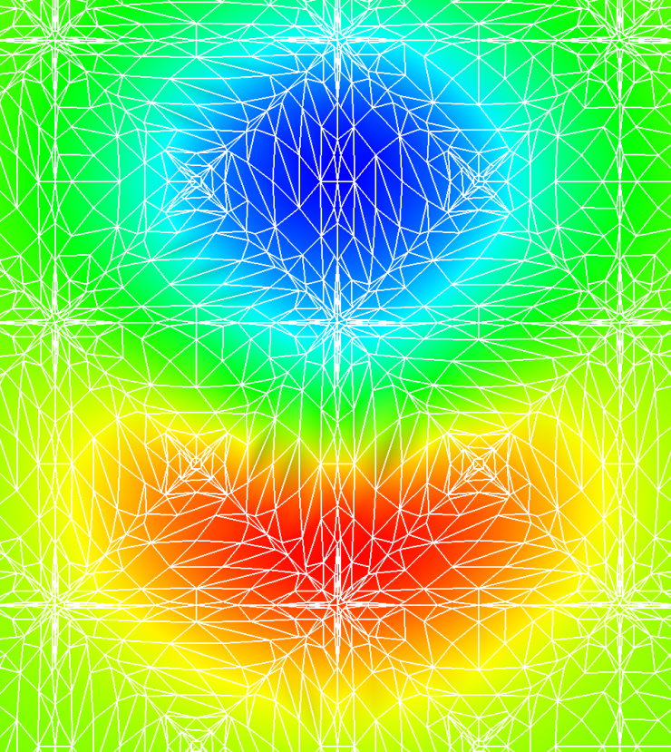

## Discontinuous Galerkin Method for solving systems of equations - CFD, CEM, ... hydrodynamics-fusion (simulate the Sun), etc!

|                           Density                            |                            X Momentum                             |                  Density                   |
|:------------------------------------------------------------:|:-----------------------------------------------------------------:|:------------------------------------------:|
|  |  |  |

##### Credits to:
- Jan S. Hesthaven and Tim Warburton for their excellent text "Nodal Discontinuous Galerkin Methods" (2007)
- J. Romero, K. Asthana, and Antony Jameson for "A Simplified Formulation of the Flux Reconstruction Method" (2015) for the
  DFR approach with Raviart-Thomas elements

### Objectives

1) Implement a complete 3D solver for unstructured CFD (and possibly MHD) using the Discontinuous Galerkin (DG) method
2) Optimize for GPUs and groups of GPUs, taking advantage of the nature of the natural parallelism of DG methods
3) Prove the accuracy of the CFD solver for predicting flows with turbulence, shear flows and strong temperature gradients
4) Make the solver available for use as an open source tool

It is important to me that the code implementing the solver be as simple as possible so that it can be further developed
and extended. There are other projects that have achieved some of the above, most notably the
HiFiLES project (formerly at https://hifiles.stanford.edu/) project, which has demonstrated high accuracy for turbulence
problems and some transonic flows with shock waves and is open source. I personally find that C++ code is very difficult
to understand due to the heavy usage of indirection and abstraction, which makes an already complex subject unnecessarily
more difficult. I feel that the Go language makes it easier to develop straightforward, more easily understandable code
paths, while providing similar if not equivalent optimality and higher development efficiency than C++.

### Why do this work?

I studied CFD in graduate school in 1987 and worked for Northrop for 10 years building and using CFD methods to design
and debug airplanes and propulsion systems. During my time applying CFD, I had some great success and some notable
failures in getting useful results from the CFD analysis. The most common theme in the failures: flows with thermal
gradients, shear flows, and vortices were handled very poorly by all known usable Finite Volume methods.

Then, last year (2019), I noticed there were some amazing looking results appearing on YouTube and elsewhere showing
well-resolved turbulent eddies and shear flows using this new "Discontinuous Galerkin Finite Elements" method...
