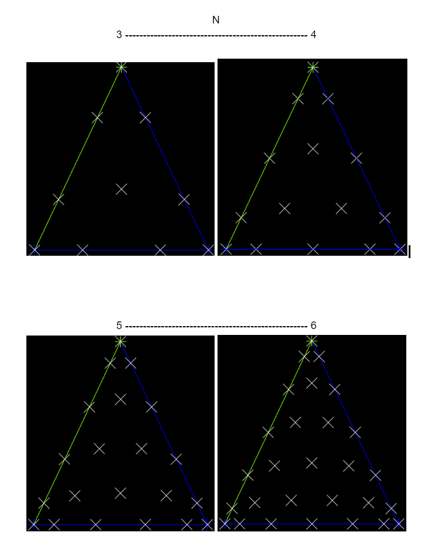

## Update: June 25, 2020):

Experimenting with node distributions - shown are the LGL points with warping per the Hesthaven approach.

Unsolved/undecided: Is it a good idea to use the next higher order LGL points for the flux and interpolate down to the solution points from there? 
This question arises because, unlike in the 1D case, there isn't an overlapping points group like the Gauss points for the interior and the LGL points at one higher polynomial degree, which conveniently accomplished having colocated solution and flux points in the interior. Instead, as can be seen in the above graphic - the interior points are at very different locations between orders (eg N=3 compared with N=4), so every transfer from flux points and solutions points will involve interpolation between points. This introduces interpolation errors I'd like to avoid...

Given that for a given multidimensional polynomial degree N the number of polynomial points needed is (N+1)(N+2)/2, so it seems impossible to find a distribution of points that would overlap as in the 1D case.

