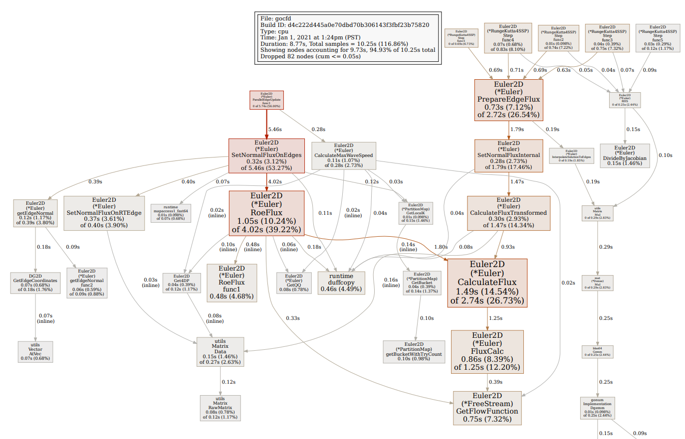
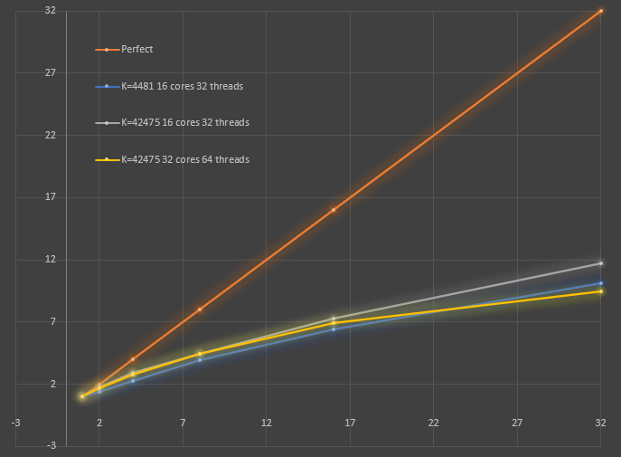

### Update: (Dec 31, 2020):

I added a command line option to generate a runtime profile for only the solver portion of the code, for example, this command:
``` gocfd 2D -I input-bench.yaml -F mesh/naca12_2d-medium-lal.su2 -s 100 -p 1 --profile```

The above command will run a 2D case with the residual progress printed every 100 steps using one processor, and will output a runtime profile that can be used to generate a PDF like this using ```go tool pprof --pdf /tmp/profile354612347/cpu.pprof```:


At this point, the runtime profile is pretty flat and clean of excess memory allocation. One helper function sticks out - GetQQ() - which reshapes various solution vectors into a more convenient shape. It's always a bad idea to mutate and copy data around in the performance pipeline - this is an example at 0.8% of the runtime. Another bad helper function is Get4DP, which gets pointers to the underlying data slices in various matrices - it's using over 1% of the overall time. Most of the usage of Get4DP applies to matrices that will never actually be used as matrices anyway, which is annoying and could be easily fixed by just not using matrices at all for those. One more: PartitionMap.GetBucket is using 1.4% of runtime, and all it's doing is retrieving which parallel bucket we need from the map using an iterative algorithm guaranteed to use at most 1 iteration. This is a consequence of the load balancing algorithm I've implemented that is not directly invertable - could improve that somehow. Overall, there's a handful of overhead totalling maybe 5% immediately apparent.



The above graph shows parallel CPU scaling for two meshes, one coarse (K=4,481) and one fine (K=42,475) on two different multi-processor Linux servers, each an AMD threadripper architecture from 2018/19. On the 16 core, 32 hyper-thread machine, we get a max scaling of around 12x on 32 threads, and we might expect to see scaling to around 20x on 32 hyperthreads if we were perfect (a hyper-thread is not equivalent to a core). Interestingly, on the machine with twice the CPU cores, we see slightly worse scaling, especially at higher parallelism request. Because of this second finding, I believe we are seeing performance degradation due to cache conflicts, where the processors are unable to happily share access to the cache because of cache contention. I've been anticipating this effect, as I've organized the memory accesses in ways that might trigger a lot of strided accesses that may not be cache friendly, which will incur this kind of effect on an SMP system. More investigation is needed to determine what is causing the apparent contention... 

