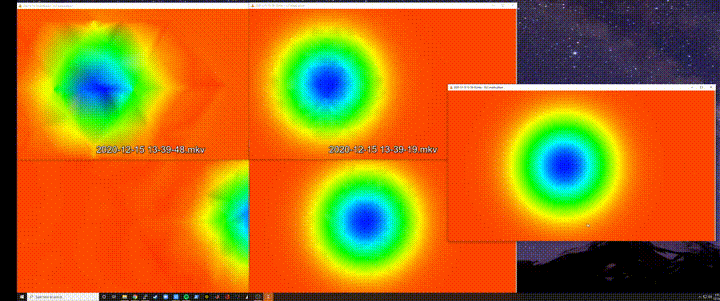

### Update: (Dec 15, 2020):

The solver now uses multiple cores / CPUs to speed things up. The speedup is somewhat limited, I'm currently getting about 6x speedup on a 16 core machine, but it was very short work to get this level of speedup (a couple of hours). The face computations are parallelized very efficiently, and the same approach and structure should be fine to scale to thousands of cores.

The shortcoming of the current parallelism is that it uses only 4 processes to handle the heavy compute matrix multiplications, so about half of the computation is only getting four cores applied to it. The number 4 comes from the number of 2D Euler equations (mass, x,y momentum and energy = 4 equations). I could improve the speedup drastically by re-arranging the core to accept partitioned meshes, but in 2D I think that might be overkill. The 3D solver will absolutely be built to do parallelism this way, so that we can use 1000 core architectures, like GPUs. I did parallelize the matrix multiplication directly, but the overhead is too high without more aggressive memory re-use work, which would begin to make the code ugly. 

The animation shows a closeup of the isentropic vortex core on three meshes:
- Coarse: 460 triangles
- Middle: 2402 triangles
- Fine: 32174 triangles

On the left is the coarse mesh at Order=2 and Order=4, middle is the same for the medium mesh and on the right is the fine mesh at Order=2. We can see the benefits of both h (grid density) and p (polynomial degree) scaling and we can also see the time penalty for each increase in h or p density.

This current work includes the use of periodic boundary conditions for the right and left boundaries, which works really well.

Next up: solid wall BCs so we can run airfoils, cylinders, etc etc.

