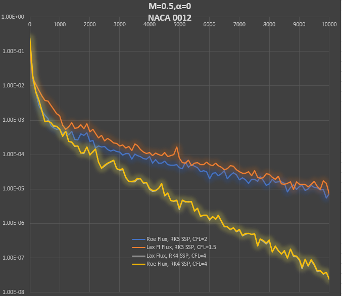

## Update: (Dec 22, 2020):

In the graph we compare convergence to steady state using two kinds of flux calculation and two types of Runge Kutta time advancement. The RK4 SSP time advancement is far superior in terms of CFL stability, as expected, without much increase in computational work or storage as compared with the RK3 method. The difference between the interpolated flux and the normal (interpolated Q, then calculate flux) is very small. The Lax and Roe flux results with RK4 are almost identical, the two lines on the graph are indistinguishable. 

A lot of progress across a number of areas this week:
- Time advancement scheme - RK4 SSP in place of RK3 SSP, big stability and speed improvement with CFL now up to 4 (was 2) on NACA 0012 test cases
- Experiments with direct interpolation of Flux to edges in place of interpolation of conserved variables and calculation of flux
-- did not appear to improve odd-even oscillations or higher order stability
-- only tested on Lax flux, as current Roe flux would need extensive changes to implement
- Convergence acceleration for steady state problems - local time stepping
- Experiments with transonic flow with moderate shocks over airfoils
-- Odd-even oscilations pollute the solution when there are shock waves and cause fatal instability for the Roe flux, although the Roe Flux is the original Roe flux, which has known issues with odd-even oscillation stability

As a result of the above experiments, the next focus is on:
1) Solution filtering with shock/discontinuity detection
- Must be compatible with higher order methods and allow high order fields with shocks without destroying the high order capture
-- I found a promising compact WENO filtering scheme designed for high order Galerkin type methods, paper [here](research/filters_and_flux_limiters/multi-resolution_WENO_limiters_3D_tetrahedral_meshes.pdf)
2) Multigrid convergence acceleration
- A complication: normal multigrid methods use agglomeration to compose the lower order meshes from the fine mesh. Currently, we only have triangular elements, so we can not use quad or other polygons that arise from agglomeration.
- A possible solution: compose RT and Lagrange elements for quads and polygons to enable later use in Navier-Stokes and multigrid

[Back to Index](../NOTES_Index.md)
