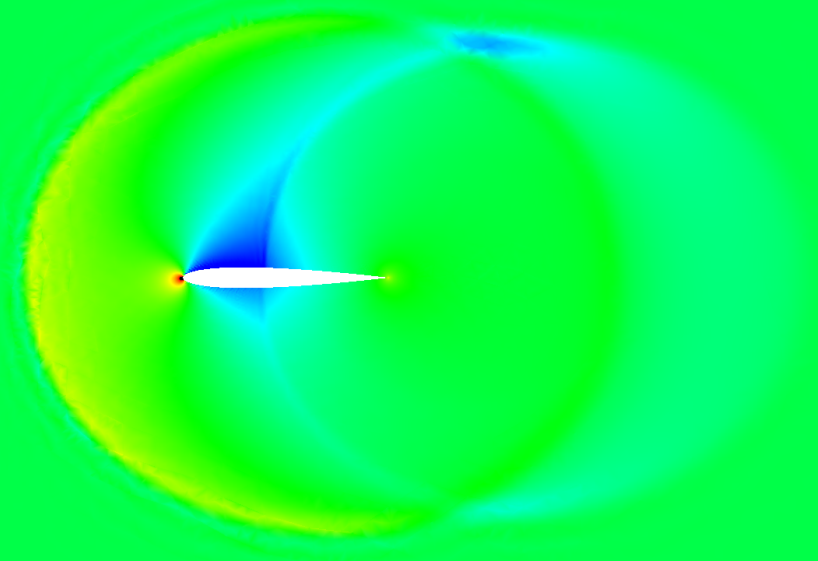
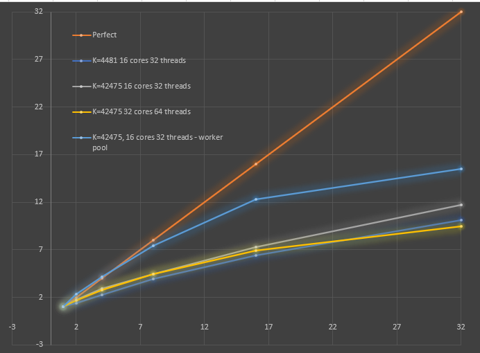

## Update: (Jan 11, 2021):

Time Accurate Abrupt Start Transients

|                    1st Order                    |                  4th Order                   |                    5th Order                    | 
|:-----------------------------------------------:|:--------------------------------------------:|:-----------------------------------------------:|
|  |  |  |

The above is just for fun - the wave interactions are all subsonic with Minf = 0.5 and AOA = 2. It's interesting to compare the resolution of the fine wave interactions between the different polynomial orders.

Improved parallelism - Time step and edge flux computations are now computed within a worker pool, which minimizes the thread start/stop overhead. I improved the cache locality by grouping edges with a given primary element number into the same group. Finally, I measured the optimal number of elements per core for best cache locality, and used that to automatically set the number of goroutines used for a given problem. The resulting parallelism is shown in the below graph



I measured the instruction rate and on the 16 core AMD Threadripper server, we're doing about 1.3 Giga-ops/second on 32 threads. Note however that each instruction can be a packed SSE or other multi-instruction like vectors, so this is not equal to the FLOPS count. To obtain the FLOPS, I'll have to count the individual types of instructions and multiply that by the number of operands per each instruction. I think it's likely we're doing about 4x the above in terms of FLOPS, so we're in the 4-5 GFlops range, but I can't be sure until doing the full count.

A very likely reason for the scaling fall-off is the limited memory bandwidth of the AMD threadripper servers, one a 1950X and the larger is a 2990WX. The memory bandwidth of the 16-core 1950X is is 50 GB/s, which translates to a limit of 3.1 GFlops for non-cache local workloads: ```3.125 Gops/s = 50 GB/s / 8-bytes per operand / 2 load and store operations per operand```, so the observed 1.3 could be hitting close to the limit when multiplied by the operands per operation, say 2x if they were all AVX SIMD operations, which is the limit of the 128-bit SIMD register on this AMD Threadripper. Another contributing data point: the 2990WX runs out of parallel scaling much earlier than the smaller server, and the explanation is that it has a problematic memory architecture: 16 cores of the 32 total have to have memory accessed remotely through the other 16. This effectively limits the memory bandwidth to 64 GB/s, which is hardly more than the smaller machine. This would explain the steeper falloff on the 2990WX.


[Back to Index](../NOTES_Index.md)
