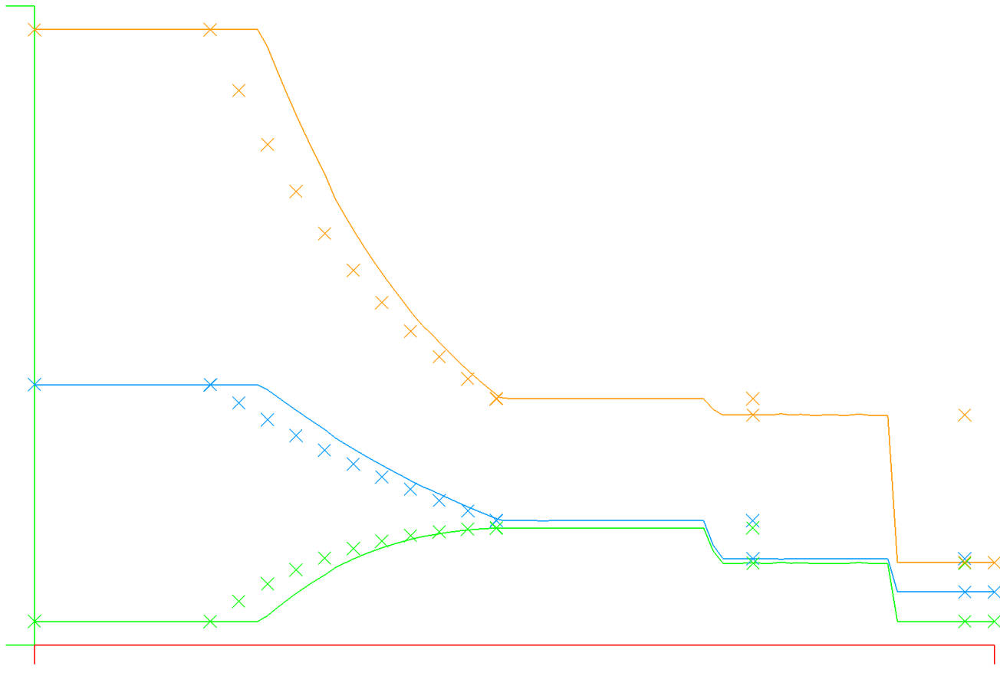
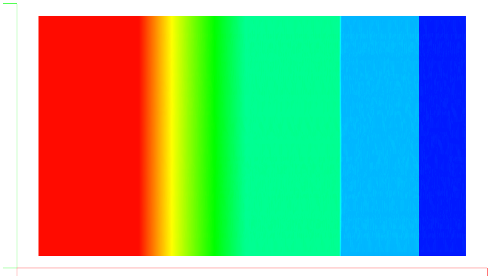

## Update: [10/24/21]

I've replaced the previous broken Runge Kutta time advancement scheme with an explicit SSP54 scheme from Gottlieb, et. al. and now the SOD shocktube results are in excellent agreement with the exact result as shown below. Note the slight bulge in the density profile at the centerline - or alternately it's a lag near the tube walls.

| SSP54 Time integration Centerline Compared with Exact Solution |            Density in 2D             |
|:--------------------------------------------------------------:|:------------------------------------:|
|                                    |  |

Previously:
Good news: the source of the bug is clearly the time integration (Runge Kutta 4th Order SSP algorithm) - simply changing one of the constants from 0.25 to 0.4 fixes the wavespeed issue completely. I'll revisit the implementation once I find out where I got the coefficients from - in this case I haven't included their source reference in the code (DOH!)

| Centerline Compared with Exact Solution |             Density in 2D             |
|:---------------------------------------:|:-------------------------------------:|
|            |  |

I've implemented a 2D version of the 1D shock tube with graphics and the exact solution for comparison.

In the above snapshot, we can see that the shock wave and all waves are running at incorrect wave speed, indicating there is a bug in the physics of the solver somewhere. This is actually good news in that I can hope the general instabilities around shock capturing could be solved by fixing this bug!

So far I've verified the bug exists with both Lax / Rusanov and Roe numerical fluxes, and is the same at 100 points resolution and 500 points.

On the bright side, we see the sharp resolution of the shock wave and near perfect symmetry in the solution, so we just need to chase down the wavespeed error in the solver physics.

