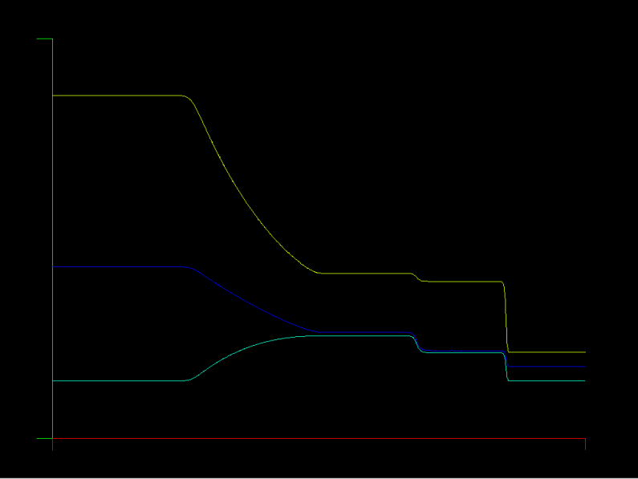

### Update: Model Problem Example #3: Euler's Equations in 1D - Sod's shock tube

The 1D Euler equations are solved with boundary and initial conditions for the Sod shock tube problem. There is an analytic solution for this case and it is widely used to test shock capturing ability of a solver.

Run the example with graphics like this:
```
bash# make
bash# gocfd -model 2 -graph -K 250 -N 1
```

You can also target a final time for the simulation using the "-FinalTime" flag. You will have to use CTRL-C to exit the simulation when it arrives at the target time. This leaves the plot on screen so you can screen cap it.
```
bash# gocfd -model 2 -graph -K 250 -N 1 -FinalTime 0.2
```
#### T = 0.2, 60 Elements
|             Linear Elements             |           10th Order Elements            |
|:---------------------------------------:|:----------------------------------------:|
|  |  |

#### T = 0.2, 250 Elements
|             Linear Elements              |            10th Order Elements            |
|:----------------------------------------:|:-----------------------------------------:|
|  |  |

#### T = 0.2, 500 Elements
|             Linear Elements              |            10th Order Elements            |
|:----------------------------------------:|:-----------------------------------------:|
|  |  |

