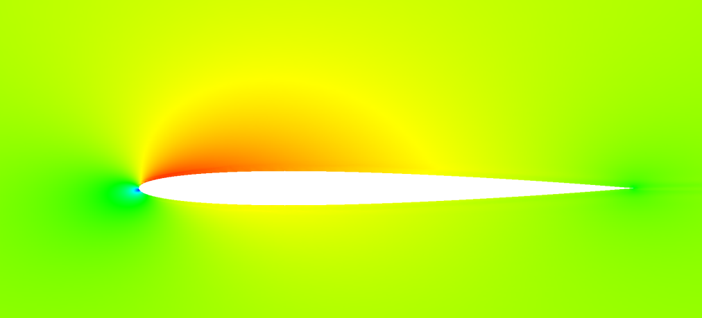
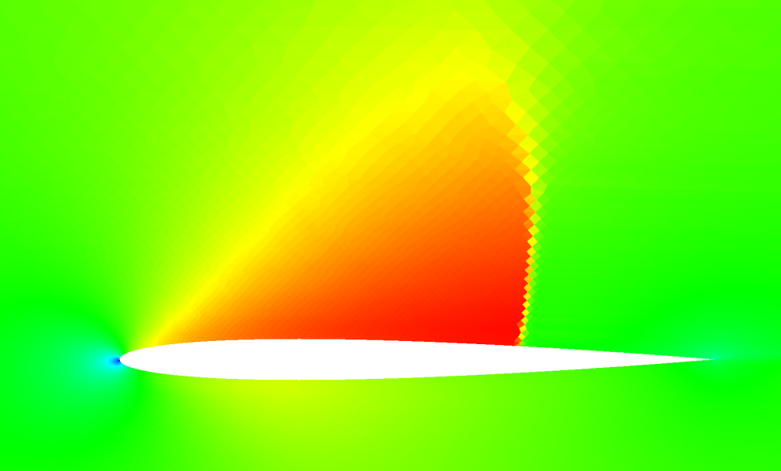

## Update: [11/28/21]

I've now continued testing and transonic cases are also working for P!=1. What's interesting now is that for P=0,
the transonic solutions and shock tube solutions are wiggle free / monotone. Below is a transonic airfoil solution at
Mach = 1.0 and 0.8, converged, on a mesh with 42,500 elements. The shock wave is finely resolved and is monotone. The convergence
was also far more monotone and rapid than the higher order solutions.

The biggest difference between the 0th order solutions and higher order is the interpolation of the flux from the interior
nodes. In the P=0 case, there is only one interior point and the flux is simply copied from the interior to the edge, as
is typical of second order finite volume schemes. Reconstruction of the shared flux value at the edge is then handled via
solving the 1D normal Riemann problem at the edge at first order. The resulting scheme should converge at 1st order, or
P+1.

I think at this point, the wiggle problem I'm experiencing is due to the non-monotonicity of the interpolation of the flux.
New extrema are being created, and my instinct is to eliminate the extrema by limiting the interpolated values to the min
and max of the values in the interior. This would remove "extrapolation artifacts", but what is the impact on numerical
accuracy?

| P=0, NACA 0012, Mach = 1.0, Alpha = 2, Interpolated Flux, Converged |
|:-------------------------------------------------------------------:|
|                        |

| P=2, NACA 0012, Mach = 0.5, Alpha = 2, Interpolated Flux, Converged |     P=0, Mach = 0.8, Fine Mesh, Converged     |
|:-------------------------------------------------------------------:|:---------------------------------------------:|
|                            |  |

## Discontinuous Galerkin Method for solving systems of equations - CFD, CEM, ... hydrodynamics-fusion (simulate the Sun), etc! 

##### Credits to:
- Jan S. Hesthaven and Tim Warburton for their excellent text "Nodal Discontinuous Galerkin Methods" (2007)
- J. Romero, K. Asthana and Antony Jameson for "A Simplified Formulation of the Flux Reconstruction Method" (2015) for the DFR approach with Raviart-Thomas elements

### Objectives

1) Implement a complete 3D solver for unstructured CFD (and possibly MHD) using the Discontinuous Galerkin (DG) method
2) Optimize for GPUs and groups of GPUs, taking advantage of the nature of the natural parallelism of DG methods
3) Prove the accuracy of the CFD solver for predicting flows with turbulence, shear flows and strong temperature gradients
4) Make the solver available for use as an open source tool

It is important to me that the code implementing the solver be as simple as possible so that it can be further developed and extended. There are other projects that have achieved some of the above, most notably the [HiFiLES](https://hifiles.stanford.edu/) project, which has demonstrated high accuracy for turbulence problems and some transonic flows with shock waves and is open source. I personally find that C++ code is very difficult to understand due to the heavy usage of indirection and abstraction, which makes an already complex subject unnecessarily more difficult. I feel that the Go language makes it easier to develop straightforward, more easily understandable code paths, while providing similar if not equivalent optimality and higher development efficiency than C++.  

### Why do this work?

I studied CFD in graduate school in 1987 and worked for Northrop for 10 years building and using CFD methods to design and debug airplanes and propulsion systems. During my time applying CFD, I had some great success and some notable failures in getting useful results from the CFD analysis. The most common theme in the failures: flows with thermal gradients, shear flows and vortices were handled very poorly by all known usable Finite Volume methods.

Then, last year (2019), I noticed there were some amazing looking results appearing on Youtube and elsewhere showing well resolved turbulent eddies and shear flows using this new "Discontinuous Galerkin Finite Elements" method...

