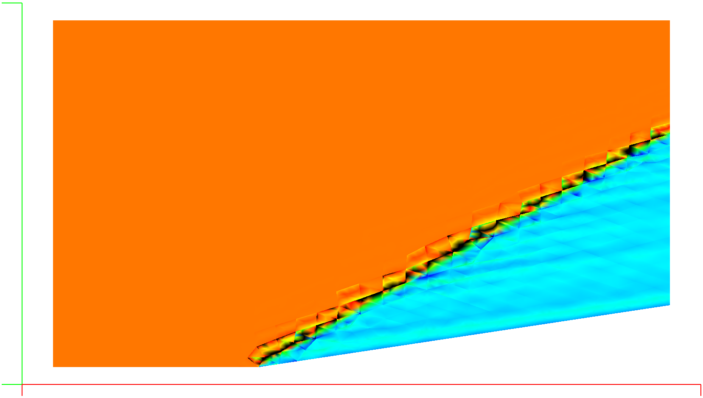

## Update: [11/2/24]

After a three-year hiatus, I'm back! I had previously confirmed that the oscillations at orders greater than P=0 are due
to interpolation through discontinuities like shock waves within elements. I have implemented artificial dissipation and
a limiter, but have not yet been able to get a workable system with monotone solutions that converge predictably.

Enter a new test case that eliminates boundary conditions and other complexities: a 15-degree wedge with an incoming
shock wave. I ran the case with the existing options to control oscillations and show solutions below for P=0, P=2, and
P=4 for this case at M=2 with 948 triangle elements.

The Barth/Jespersen limiter is able to control the oscillations, smearing the shock over 3 or so triangle elements, but
the solutions don't converge properly due to the widely reported "buzzing" of residual as the shock switch oscillates.

The Persson C0 dissipation operator is better behaved, and the solutions converge well. The shock is resolved within the
triangle elements instead of smearing over multiple elements. The issue with Persson is that the parameter Kappa varies
by case and the runtime penalty is very large, as we have to solve for a higher order field to get the dissipation
values, similar in complexity to implementing a viscous flow field.

|                    No Limiter P=0                    |                            P=2                             |                                P=4                                 |
|:----------------------------------------------------------:|:----------------------------------------------------------:|:------------------------------------------------------------------:|
|      |      |                        No Solution Possible                        |
|                Barth Jespersen Limiter                 |                                                            |                                                                    |
|      |       |               |
|           Persson C0 Continuous Dissipation            |                                                            |                                                                    |
|  |  |  |

[Back to Index](../NOTES_Index.md)
