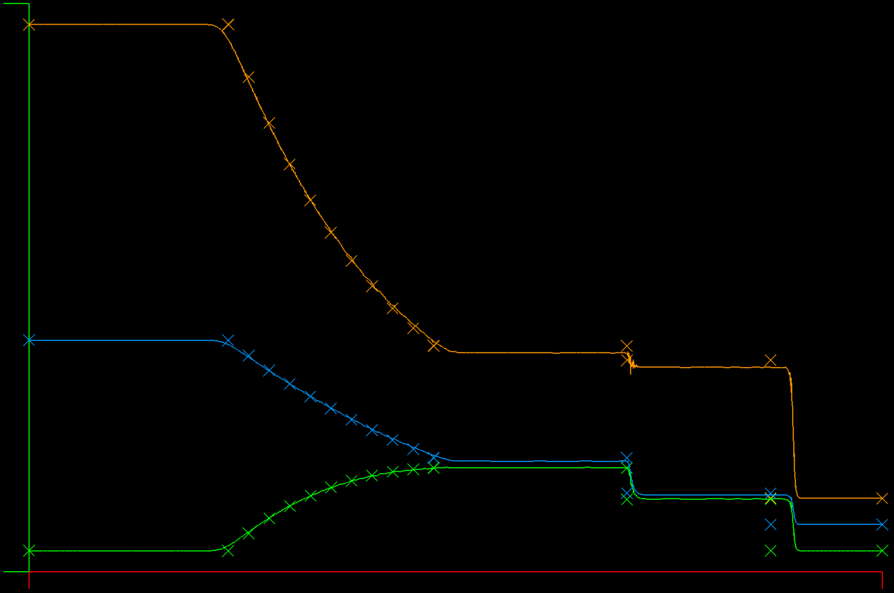

## Update: (May 25, 2020): Roe Flux with DFR - Euler 1D compared to Analytic Solution in real time

#### T = 0.223, N=4, Roe Flux, 600 Elements


This is cool - being able to see exactly the errors and successes in realtime. The above is a snap of an interim result where I'm now showing the exact solution in symbols overlaying the simulation in realtime and sure enough we see a shock speed error on the leading shock wave, along with excellent reproduction of the smooth expansion flow.

I also went back and checked the Galerkin (non-DFR) Euler case and it has the same error in shock propagation speed as the DFR/Roe result, which says there's a common error somewhere. It's good to spend time doing basic accuracy tests!

You can recreate this using ``` gocfd -graph -model 5 -CFL 0.75 -N 4 -K 600```

