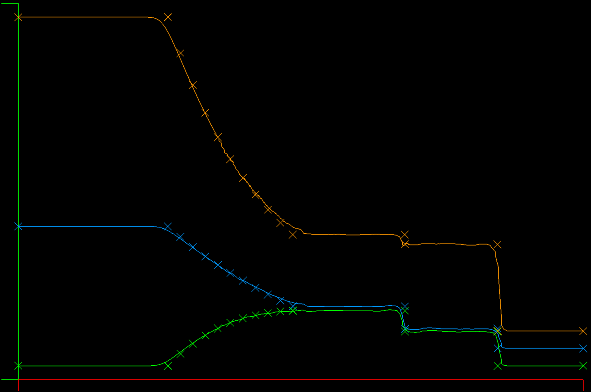
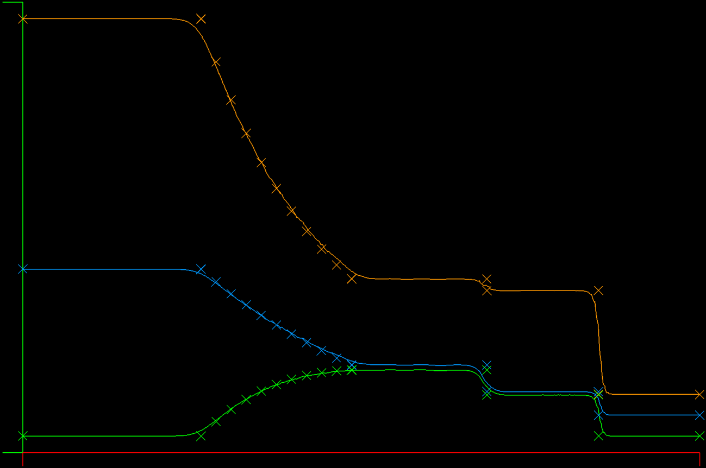
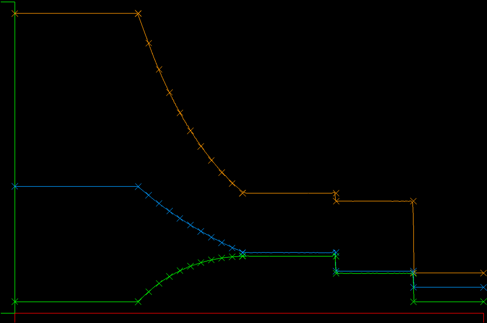
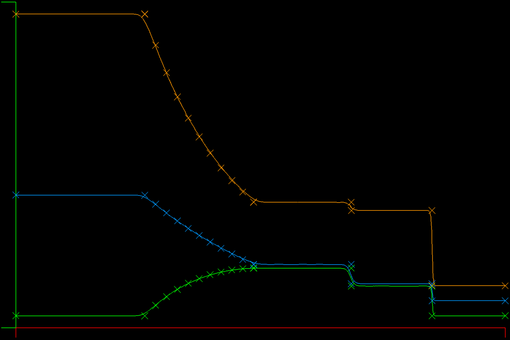

## Update: May 26, 2020): Verified DFR and Roe Flux after fixing the Exact solution to the Sod shock tube

#### Resolved DFR/Roe solution compared to exact at T = 0.2, N=3, 2000 Elements

A highly resolved solution from the DFR/Roe solver looks qualitatively good without bumps or other instability artifacts. The contact discontinuity is in the right place and very sharply resolved.

#### Comparison of DFR/Roe and Galerkin/Lax at T = 0.2, N=2, 200 Elements
|           DFR Roe (fixed flux)            |          Galerkin Lax           |
|:-----------------------------------------:|:-------------------------------:|
|  |  |

I removed a term that was present in the 3D version of the flux that doesn't make sense in 1D, and now the contact discontinuity is in the right place and the bump is gone.

Now, when we compare the DFR Roe flux (left) to the Galerkin Lax flux (right), we can see the Roe solution has a steeper contact discontinuity and shock, as we would expect. Both solutions get the locations correctly.

I also optimized some of the DFR code and timed each solution. Surprisingly, the DFR/Roe is slightly faster than the Galerkin/Lax.

#### T = 0.2, N=3, 2000 Elements
|       DFR Roe (broken flux)       |           Galerkin Lax           |
|:---------------------------------:|:--------------------------------:|
|  |  |

DFR/Roe versus Galerkin/Lax: In the DFR solution the contact discontinuity is steeper than the GK/Lax solution. There is a very slight position error for the contact discontinuity in the DFR solution and also a bump on the left side of it, an artifact of the underdamped aliasing.

#### T = 0.2, N=3, Galerkin Lax Flux, 500 Elements

The shock speed problem I saw yesterday turns out to have been the exact solution :-)

After correcting the exact solution to Sod's shock tube problem, the two Euler solvers match up pretty well all around, with some small differences between them - phew!

