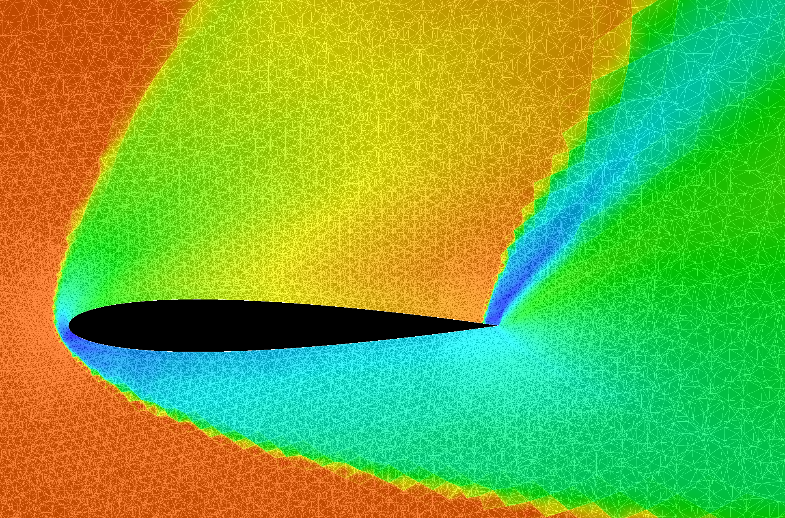
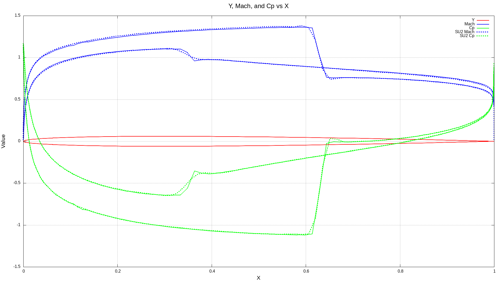
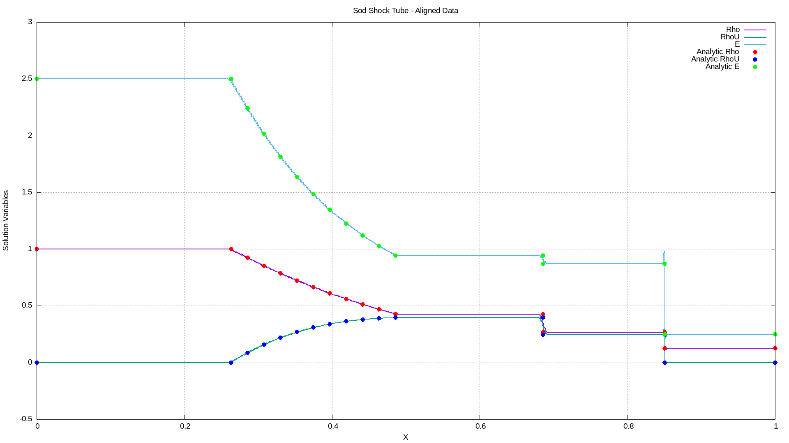

# gocfd

A computational fluid dynamics (CFD) solver written in Go.

[Click here to see what we're currently working on](UPDATES.md) 

## 2D Euler Solver using DFR / DG elements is done

The 2D solver implements the Direct Flux Reconstruction (DFR) method within 
Galerkin Discontinuous Finite Elements (GDFE) tailored
for unstructured mesh simulations. The next phase of this project will focus 
on building a 3D solver using Flux Reconstruction DG elements with a split 
flux Entropy solver so that we can implement turbulence capture and stable 
numerics for order P=4 and beyond in 3D.

For a comprehensive log of project updates and progress for the 2D solvers, 
refer to [CHANGELOG-2D.md](CHANGELOG-2D.md). Currently, the solver is
capable of handling 2D Euler equations, supporting the input of unstructured meshes and boundary conditions for flowfield
simulation. Ongoing developments focus on the efficient capture of shock waves and contact discontinuities. Look
[here](INTRODUCTION.md) for some background on this project and attributions.

Future enhancements, following shock capture improvements, will include the integration of viscous flowfields, along with the
possible addition of various implicit time integration solvers.

|  NACA 0012 Airfoil at M=5, Alpha=35  |   Comparison to SU2 Euler Solver at P=1    | Shocktube Compared w/Analytical Solution at P=4 |
|:------------------------------------:|:------------------------------------------:|:-----------------------------------------------:|
|  |  |       |

# Quick Start Guide

## Supported Mesh Input Formats

Both Gambit (.neu) and SU2 (.su2) unstructured triangular mesh formats are accepted. You can check to see that your mesh
was input correctly by plotting it with the -m flag.

## Supported Platforms

I've run the code on many Ubuntu Linux distributions, and also on Windows 10. Because it is written in Go, it should be portable
to many platforms that support OpenGL graphics.

## Building on Ubuntu Linux

You can install all dependencies using the project Makefile target "deps". 
Note that there are some X11 and Mesa packages installed as part of the 
dependencies, this is due to some unit tests that use the AVS graphics 
package. The runtime of the solver does not use graphics.

```
make deps
```


To run an airfoil test case on Linux:
```
### 2D Airfoil Test Case
cd test_cases/Euler2D/SU2-naca12/
./runme.sh
```
This will run the SU2 NACA 0012 airfoil test case at order 0. You can configure 
other parameters using the yaml input file.

You can visualize solutions nicely using the "gobcfd" executable that is part
of the AVS package available at https://github.com/notargets/avs. Make sure 
you include a function name to plot in the gocfd YAML configuration file in the 
"PlotFields" section:
```
gobcfd -mesh meshfile.gobcfd -solution solutionfile.gobcfd
```