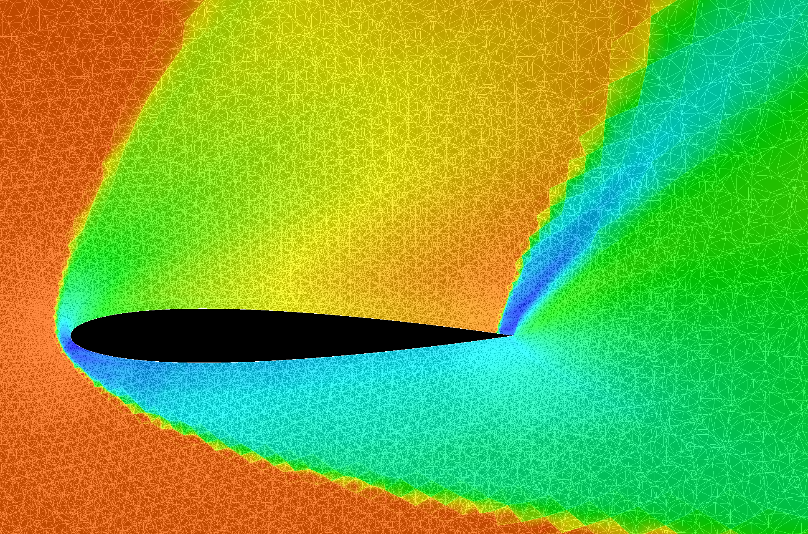

# gocfd

A computational fluid dynamics (CFD) solver written in Go.

The 2D solver implements the Direct Flux Reconstruction (DFR) method within 
Galerkin Discontinuous Finite Elements (GDFE) tailored
for unstructured mesh simulations. The next phase of this project will focus 
on building a 3D solver using Flux Reconstruction DG elements with a split 
flux Entropy solver so that we can implement turbulence capture and stable 
numerics for order P=4 and beyond in 3D.

For a comprehensive log of project updates and progress, please refer to [CHANGELOG.md](CHANGELOG.md). Currently, the solver is
capable of handling 2D Euler equations, supporting the input of unstructured meshes and boundary conditions for flowfield
simulation. Ongoing developments focus on the efficient capture of shock waves and contact discontinuities. Look
[here](INTRODUCTION.md) for some background on this project and attributions.

Future enhancements, following shock capture improvements, will include the integration of viscous flowfields, along with the
possible addition of various implicit time integration solvers.

|  NACA 0012 Airfoil at M=5, Alpha=35  |
|:------------------------------------:|
|  |

# Quick Start Guide

## Supported Mesh Input Formats

Both Gambit (.neu) and SU2 (.su2) unstructured triangular mesh formats are accepted. You can check to see that your mesh
was input correctly by plotting it with the -m flag.

## Supported Platforms

I've run the code on many Ubuntu Linux distributions, and also on Windows 10. Because it is written in Go, it should be portable
to many platforms that support OpenGL graphics.

## Building on Ubuntu Linux

First, ensure the Go language is installed and available in your PATH. Proceed to install the necessary prerequisites:

```
sudo apt update
sudo apt install libx11-dev libxi-dev libxcursor-dev libxrandr-dev libxinerama-dev mesa-common-dev libgl1-mesa-dev libxxf86vm-dev

make
```
```

## Running Test Cases

### 1D Shock Tube Test Case
#### Without Graphics
gocfd 1D

#### With Graphics Enabled
export DISPLAY=:0
gocfd 1D -g

### 2D Airfoil Test Case
gocfd 2D -F test_cases/Euler2D/naca_12/mesh/nacaAirfoil-base.su2 -I test_cases/Euler2D/naca_12/input-wall.yaml -g -s 50 -z 0.08
```

## Code Review Guidelines

To review the physics implementation, explore the code within the `model_problems` directory. Each file implements a physical
model or an additional numerical method.

For insights into the math/matrix library, see [utils/matrix_extended.go](utils/matrix_extended.go) and
[utils/vector_extended.go](utils/vector_extended.go). They utilize a chained operator syntax prioritizing reuse, reducing
copying, and clarifying operand dimensionality. While not exhaustive, especially in terms of value assignment and indexing, this
approach mirrors the functionalities found in related texts and MATLAB, proving both functional and useful. The syntax
resembles reverse Polish notation (RPN), where values accumulate through chained operations.
For example, consider this implementation:
```rhsE = - Dr * FluxH .* Rx ./ epsilon```. Here, `Dr` stands for the "Derivative Matrix", `Rx` represents (1 / J) applying the
transform of R to X, and `epsilon` is the metallic impedance, all applied to the Flux matrix:
```
RHSE = el.Dr.Mul(FluxH).ElMul(el.Rx).ElDiv(c.Epsilon).Scale(-1)
```

## Details on Ubuntu packages needed to run the code
Here is what I'm using as a platform:
```
me@home:bash# go version
go version go1.23.3 linux/amd64

me@home:bash# lsb_release -a
No LSB modules are available.
Distributor ID:	Ubuntu
Description:	Ubuntu 24.04.1 LTS
Release:	24.04
Codename:	noble
...
```
You also need to install some X11 and OpenGL related packages in Ubuntu, like this:
```
apt update
apt install libx11-dev libxi-dev libxcursor-dev libxrandr-dev libxinerama-dev mesa-common-dev libgl1-mesa-dev
```
A proper build should go like this:
```
me@home:bash# make
go fmt ./...  && go install ./...
go: downloading gonum.org/v1/gonum v0.7.0
go: downloading github.com/notargets/avs v0.0.7-0.20201217183319-0f9c8f3d02f3
go: downloading github.com/james-bowman/sparse v0.0.0-20200204164517-b588421ac5da
go: downloading github.com/spf13/cobra v1.0.0
go: downloading github.com/spf13/viper v1.7.0
go: downloading github.com/mitchellh/go-homedir v1.1.0
go: downloading github.com/ghodss/yaml v1.0.0
go: downloading github.com/pkg/profile v1.5.0
go: downloading gopkg.in/yaml.v2 v2.3.0
go: downloading github.com/hashicorp/hcl v1.0.0
go: downloading github.com/pelletier/go-toml v1.8.0
go: downloading github.com/spf13/afero v1.2.2
go: downloading github.com/fsnotify/fsnotify v1.4.9
go: downloading github.com/magiconair/properties v1.8.1
go: downloading github.com/mitchellh/mapstructure v1.3.2
go: downloading github.com/spf13/cast v1.3.1
go: downloading github.com/spf13/jwalterweatherman v1.1.0
go: downloading github.com/spf13/pflag v1.0.5
go: downloading github.com/subosito/gotenv v1.2.0
go: downloading gopkg.in/ini.v1 v1.57.0
go: downloading golang.org/x/sys v0.0.0-20220722155257-8c9f86f7a55f
go: downloading golang.org/x/text v0.3.8
go: downloading github.com/go-gl/gl v0.0.0-20190320180904-bf2b1f2f34d7
go: downloading github.com/go-gl/glfw/v3.3/glfw v0.0.0-20200420212212-258d9bec320e
go: downloading github.com/gonum/floats v0.0.0-20181209220543-c233463c7e82
go: downloading github.com/gonum/internal v0.0.0-20181124074243-f884aa714029
go: downloading github.com/go-gl/glfw v0.0.0-20190409004039-e6da0acd62b1
run this -> $GOPATH/bin/gocfd
```
