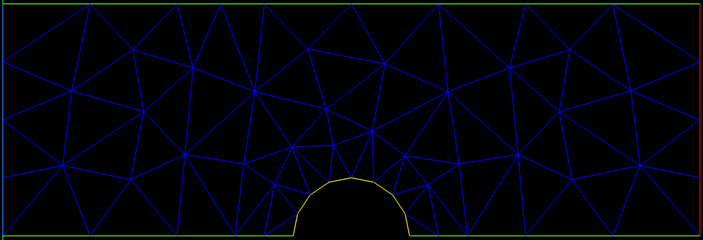
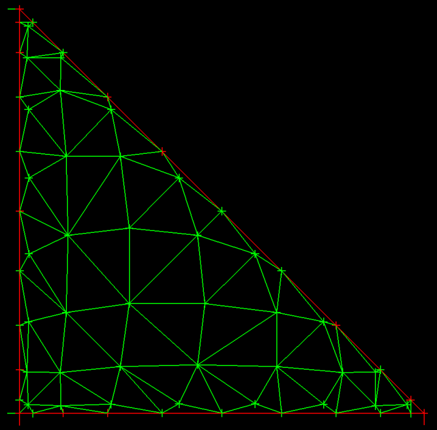

# gocfd
Awesome CFD solver written in Go



## An implementation of the Discontinuous Galerkin Method for solving systems of equations

### Credits to Jan S. Hesthaven and Tim Warburton for their excellent text "Nodal Discontinuous Galerkin Methods" (2007)

### Objectives

1) Implement a complete 3D solver for unstructured CFD (and possibly MHD) using the Discontinuous Galerkin (DG) method
2) Optimize for GPUs and groups of GPUs, taking advantage of the nature of the natural parallelism of DG methods
3) Prove the accuracy of the CFD solver for predicting flows with turbulence, shear flows and strong temperature gradients
4) Make the solver available for use as an open source tool

It is important to me that the code implementing the solver be as simple as possible so that it can be further developed and extended. There are other projects that have achieved some of the above, most notably the [HiFiLES](https://hifiles.stanford.edu/) project, which has demonstrated high accuracy for turbulence problems and some transonic flows with shock waves and is open source. I personally find that C++ code is very difficult to understand due to the heavy usage of indirection and abstraction, which makes an already complex subject unnecessarily more difficult. I feel that the Go language makes it easier to develop straightforward, more easily understandable code paths, while providing similar if not equivalent optimality and higher development efficiency than C++.  

### Why do this work?

I studied CFD in graduate school in 1987 and worked for Northrop for 10 years building and using CFD methods to design and debug airplanes and propulsion systems. During my time applying CFD, I had some great success and some notable failures in getting useful results from the CFD analysis. The most common theme in the failures: flows with thermal gradients, shear flows and vortices were handled very poorly by all known usable Finite Volume methods.

Then, last year (2019), I noticed there were some amazing looking results appearing on Youtube and elsewhere showing well resolved turbulent eddies and shear flows using this new "Discontinuous Galerkin Finite Elements" method...

### Guide to code review

If you are interested in reviewing the physics and how it is implemented, look through the code in "model_problems". Each file there implements one physics model or an additional numerical method for a model.

If you want to look at the math / matrix library implementation, take a look at the code in utils/matrix_extended.go and utils/vector_extended.go. I've implemented a chained operator syntax for operations that favors reuse / reduces copying and makes clear the dimensionality of the operands. It is far from perfect and complete, especially WRT value assignment and indexing, as I built the library to emulate and implement what was in the text and matlab, however it is functional / useful. The syntax is somewhat like RPN (reverse polish notation) in that you manage an accumulation of value over chained operations.

For example, the following line implements:
```rhsE = - Dr * FluxH .* Rx ./ epsilon``` Dr is the "Derivative Matrix" and Rx is (1 / J), applying the transform of R to X, and epsilon is the metalic impedance, all applied to the Flux matrix:
```
	RHSE = el.Dr.Mul(FluxH).ElMul(el.Rx).ElDiv(c.Epsilon).Scale(-1)
```

### QuickStart

Using Ubuntu Linux, do the following:
```
### Build
me@home:bash# sudo apt update
me@home:bash# sudo apt install libx11-dev libxi-dev libxcursor-dev libxrandr-dev libxinerama-dev mesa-common-dev libgl1-mesa-dev
me@home:bash# make
```
```
### Run with graphics:
me@home:bash# export DISPLAY=:0
me@home:bash# gocfd 1D -g
```
```
### Run without graphics:
me@home:bash# gocfd 1D
```
### Updates (Nov 9 2020):
Testing the calculation of divergence using an exact polynomial flux field calculated in Matlab. It seems there's a bug involving the indexing or process using the full transformed calculation with edge computations because the divergence is nearly exact for the first element (k=0) and the mass equation divergence, but deviates for other elements and equations. It's very useful at this point to verify the accuracy of the divergence operator because the bulk of the solver relies on this one operator, and so we can characterize the accuracy (and stability) of the algorithm almost entirely by evaluating the divergence.


Above we see the polynomial flux field in a series of graphs for each equation in the conservative variables and the resulting divergence for each equation. All values are real, not complex and appear smooth (and thus differentiable!).

### Updates (Nov 5 2020):
Progress on the 2D Euler equations solution! There are now unit tests showing that we get zero divergence for the freestream initialized solution on a test mesh. This includes the shared face normals and boundaries along with the solution interpolation. The remaining work to complete the solver includes boundary conditions and the Roe/Lax Riemann flux calculation at shared faces - each of which are pure local calculations.

I'm very happy with the simplicity of the resulting algorithm. There are two matrix multiplications (across all elements), a matrix multiplication for the edge interpolation and a single calculation per edge for the Riemann fluxes. I think the code is easily understood and it should be simple to implement in GPU and other parallel systems. 

### Updates (Nov 2 2020):
Divergence is now tested correct for transformed triangles, including the use of the ||n|| scale factor to carry ((Flux) dot (face normal)) correctly into the RT element degree of freedom for edges.

I'm working now on the actual data structures that will efficiently compute the flux values, etc., with an eye on the memory / CPU/GPU performance tradeoffs. Contiguous space matrix multiplications are supported well by GPU, so I'm focusing on making most everything a contiguous space matrix multiply.

### Updates (Oct 2 2020):
Up next: I'm working on initializing the 2D DFR solution method. My plan is to construct a separate structure containing all faces such that we can iterate through the face structure to construct the fluxes on each face only once. Each face is shared by two elements, and each face has a complex and expensive flux construction that unifies the computed values from each element into a single flux shared by both. By constructing a dedicated group of faces, we can iterate through them in parallel to do that construction without duplication. The shared flux values will be placed directly into the flux storage locations (part of the RT element) so that the divergence can be calculated to advance the solution.


Above we see three elements and within each are the interior solution points and along the edges/faces are the flux points for Order = 1. Each RT element has 12 points, 3 on each face and three interior, while the three Order 1 solution points are in the interior.



I've implemented a Delaunay triangulation that converts 2D point fields with fixed boundaries into a triangle mesh. The picture shows the RT7 element triangulated using the method. Now we can use the triangulation within the reference element to implement contour tracing and other graphics to display the field contents within the high order elements. This approach requires that we triangulate only the reference element, then we use that triangulation to fill the insides of the triangles in the mesh (using the affine transform).

I'm adding a contour plotting capability that will provide display of functions within the model. The approach I'm favoring is to triangulate the points within the full RT element, including the vertices, which will enable the plotting of the interpolated solution values used for the edge flux definitions in addition to the interior solution points.

The triangulated mesh containing vertices, the interior solution points and the edge flux points is then used for a linear contour algorithm to produce the isolines for the whole mesh. The resulting isoline field is a linearized view of the polynomials, but is sampled at the full resolution of the polynomial basis at N+1, which should provide an accurate representation of the solution field, though not at the same polynomial order. This should be very useful for visually characterizing the interpolation to the flux points on edges and other attributes of the solution process, in addition to showing actual solutions with high fidelity.

### Updates (Sep 9 2020):
I've now validated the RT element up to 7th order for divergence of polynomial vector fields. Happily, the special case of zero divergence is being captured with high precision.

The reason this took me quite a while: the choice of basis functions for the RT polynomial must be approached with great care, as the derivatives of the basis must be normalized properly. The literature provides many examples of alternatives for the basis, many of which seem to produce erroneous divergence values that do not show convergence, or even diverge with increasing element order. Others use moments of dot products for the interior, which is not the same process that is used by Jameson and Romero's DFR work. In the interest of staying close to that work, I ended up using the same 2D polynomial basis for the Simplex (triangle) as used by Westhaven with the procedure described by Romero to create the basis for the RT element, which preserves the connection with the Lagrange element interior points. I now have validated that this combination accurately reproduces divergence for polynomial functions and shows convergent behavior with good accuracy for transcendental fields up to 7th order.

### Updates (Aug 20 2020):
I finally have a working Raviart-Thomas element at any K up to 7th order now. The limitation to 7th order is a matter of finding optimized point distributions for this element type. This RT element closely follows the approach described in [Romero and Jameson](https://github.com/Notargets/gocfd/blob/master/research/convergence_and_fluxes/DFR/romero_jsc_2017.pdf) for the 3rd and 4th orders, and uses the point distributions from [Williams and Shun](https://github.com/Notargets/gocfd/blob/master/research/convergence_and_fluxes/DFR/williams-shun-jameson-quadrature.pdf) for orders 1,2 and 5-7. The RT vector basis cooefficients for order N are solved numerically in one matrix inversion, yielding a full polynomial basis with (N+1)(N+3) terms implemented as degrees of freedom defining the basis distributed on the [-1,-1] reference triangle. There are 3(N+1) points on the faces of the triangle, and N(N+1)/2 points defining the interior, and each of the interior points hosts 2 degrees of freedom, one for each orthogonal basis vector [r,s] = [1,0] and [0,1], the axis vectos for r and s. The zero order (N=0) element has 0 interior points and 3 face points, one on each face, the N=1 element has 2 points on each face and 1 point in the interior, the N=2 has 9 points on faces (3 per edge), and 3 interior points, for a total of (2+1)(2+3)=15 degrees of freedom.

RT0 Element | RT7 Element
:-------------------------:|:-------------------------:
 | 

The Raviart-Thomas elements at orders 1 and 7 are shown above, with basis vectors as green lines. On the left is RT1, showing a single interior point with two basis vectors. The RT7 element has 28 interior points, each with two basis vectors. The edges of RT7 each have 8 points, each with a single normal vector for the basis.

Here is the cool part: the number of interior points within each of the above elements matches that of the Lagrange element used for the Nodal Galerkin models(!) That means we can have a Nodal Galerkin element at order N=1, which has (N+1)(N+2)/2 = 3 points inside it have a companion RT_2 element that also has 3 interior points. This makes it possible to represent gradient, curl, and divergence of our scalar variables residing inside the Nodal Galerkin elements in the RT_N+1 elements, where those fields are calculated using the two dimensional polynomial basis in a vector preserving way. All this without interpolating between the Lagrangian element and the RT element - the point locations are shared between them, which removes a major source of error and complication. 

I'm still implementing tests, but the basics are finally there. Next step: implement gradient, divergence, curl operators and test for convergence to known solutions to [ sin(y), sin(x) ]. After that, I'll need to implement the calculation of the coordinate transform Jacobian, which actually follows from the previous operators in that the calculation of [ J ] includes the same derivatives used in the gradient.

### Updates (July 7 2020):

Researching the use of the Raviart-Thomas finite element to represent the numerical flux and divergence.

I've found a lot of good material on these elements and the Raviart-Thomas element, but I'm struggling to find a simple connection between the convenient techniques used for Lagrange elements as expressed in the Hesthaven text and non-Lagrangian elements. In particular, the Lagrange elements have the property that the interpolation operator and the modal representation are connected simply through the Vandermonde matrix. This enables the easy transformation between function values at nodes within the element and interpolations and derivatives. If we could use a Raviart-Thomas element similarly to a Lagrange element, we'd just compose a Vandermonde matrix and proceed as normal to compute the divergence, but, alas, I've struggled to find a way to do this.

I have found the open source element library "Fiat", part of FEniCS, that implements RT elements and will produce a Vandermonde matrix for them, but I'm not convinced it's useful in a way similar to Lagrange elements. Also, I found that the ordering of the polynomial expansions are strange in the RT elements in Fiat - not sure it matters, but it's not a straightforward "smallest to largest" ordering, which brings into question how to use that Vandermonde matrix in general.

So - I'm back to basic research on the meaning of finite elements and how to properly represent the flux on Raviart-Thomas elements. Papers I'm reading can be found [here](research/convergence_and_fluxes).

### Updates (June 25, 2020):


Experimenting with node distributions - shown are the LGL points with warping per the Hesthaven approach.

Unsolved/undecided: Is it a good idea to use the next higher order LGL points for the flux and interpolate down to the solution points from there? 
This question arises because, unlike in the 1D case, there isn't an overlapping points group like the Gauss points for the interior and the LGL points at one higher polynomial degree, which conveniently accomplished having colocated solution and flux points in the interior. Instead, as can be seen in the above graphic - the interior points are at very different locations between orders (eg N=3 compared with N=4), so every transfer from flux points and solutions points will involve interpolation between points. This introduces interpolation errors I'd like to avoid...

Given that for a given multidimensional polynomial degree N the number of polynomial points needed is (N+1)(N+2)/2, so it seems impossible to find a distribution of points that would overlap as in the 1D case.

### Updates (June 13, 2020):


Implemented a Gambit formatted mesh reader and updated AVS to plot tri meshes.

### Updates (June 9, 2020):

Success!

I reworked the DFR solver and now have verified optimal (N+1) convergence on the Euler equations for a density wave (smooth solution). The convergence orders for N=2 through N=6 are:
```
DFR Integration, Lax Friedrichs Flux
Order = 2, convergence order = 2.971
Order = 3, convergence order = 3.326
Order = 4, convergence order = 4.906
Order = 5, convergence order = 5.692
#Affected by machine zero
Order = 6, convergence order = 3.994

DFR Integration, Roe Flux
Order = 2, convergence order = 2.900
Order = 3, convergence order = 3.342
Order = 4, convergence order = 4.888
Order = 5, convergence order = 5.657
#Affected by machine zero
Order = 6, convergence order = 4.003
```
Note that:
1) No limiter is used on the smooth solution
2) Odd orders converge at something less than the optimal rate
3) Even orders converge at approximately N+1 as reported elsewhere

I've noticed dispersion errors in the odd order solutions for the SOD shock tube when using a limiter - the shock speed is wrong. I'm not sure what causes the odd orders to behave so differently at this point. The difference in convergence rate between even and odd orders suggests there may be a material issue/phenomenon for odd orders, though I haven't found anything different (like a bug) in the process, which leads to a question about the algorithm and odd orders. One thing to think about: Even orders put a solution point in the center of each element, while odd orders do not...

At this point I feel confident that I'm able to move on to multiple dimensions with this approach. I'll definitely need to implement a different and/or augmented limiter approach for solutions with discontinuities, likely to involve a "shock finder" approach that only uses the limiter in regions that need it for stability.

A note on the refactored DFR approach: In the refactored DFR, an N+2 basis is used for the flux that uses (N+3) Legendre-Gauss-Lobato (LGL) points, which include the edges of each element. The solution points use a Gauss basis for the element, which does not include the edge points, and there are (N+1) interior points for the solution. At each solver step, the edge points of the solution are interpolated from the (N+1) solution points to the edges of the (N+3) flux basis and then the flux is computed from the solution primitive variables. The derivative of the flux is then computed on the (N+3) points to form the solution RHS components used in the (N+1) solution. The result is that the flux is a polynomial of order (N), and so is the solution.

Below is:
```
Euler Equations in 1 Dimension
Solving Sod's Shock Tube
Algorithm: DFR Integration, Roe Flux
Solution is limited using SlopeLimit
CFL =   2.5000, Polynomial Degree N = 8 (1 is linear), Num Elements K = 2000

SOD Shock Location = 0.6753
Rho Integration Check: Exact = 0.5625, Model = 0.5625, Log10 Error = -4.3576
case,K,N,CFL,Log10_Rho_rms,Log10_Rhou_rms,Log10_e_rms,Log10_rho_max,Log10_rhou_max,Log10_e_max
"DFR Integration, Roe Flux",2000,8,2.5000,-2.6913,-2.7635,-2.2407,-1.7183,-1.6491,-1.1754
```


### Updates (June 2, 2020): 

Implemented a smooth solution (Density Wave) in the Euler Equations DFR solver and ran convergence studies. The results show a couple of things:
1) Rapid convergence to machine zero across polynomial order and number of elements
2) Order of convergence is N, not the optimal (N+1)
3) Aliasing instability when using the Roe flux
4) The "SlopeMod" limiter destroys the accuracy of the smooth solution

While it was very nice to see (1) happen, the results of (2) made me take a harder look at the DFR approach implemented now. I had taken the "shortcut" of having set the flux at the element faces, and not modifying the interior flux values, which has the impact of converting the flux into a polynomial of order (N-2) due to the removal of the two faces from the order N basis by forcing their values. It seems that the resulting algorithm has a demonstrated order of (N-1) in convergence rate as a result.

One of the reasons I took the above shortcut is that right now we are using the "Legendre-Gauss-Lobato" (LGL) nodes for the algorithm, per Hesthaven, and the LGL points include the face vertices for each element, which makes it impossible to implement the Jameson DFR approach for DFR.

In the Jameson DFR, the Gauss quadrature points do not include the face vertices. The algorithm sets the flux values at the face vertices, then performs an interpolation across the combination of interior and face (N+1+2) vertices to determine the coefficients of the interior flux polynomial such that the new polynomial passes through all (N+1) interior points in the element and the two face vertices. The resulting reconstructed flux polynomial is of order (N+2) and resides on the (N+3) face and solution interior points. Derivatives of this flux are then used directly in the solution algorithm as described in this excellent [AFOSR presentation](http://aero-comlab.stanford.edu/Papers/AFOSR-Meeting-Jul-2014.pdf).

The Jameson DFR algorithm provides an equivalent, but simpler and more efficient (15% faster) way to achieve all of the benefits of DG methods. The DFR solver uses the differential form of the target equations, rather than the integral form, which makes it easier to attack more complex combinations of target equations. DFR has also been extended by Jameson, et al to incorporate spectral methods with entropy stable properties.

### Updates (May 26, 2020): Verified DFR and Roe Flux after fixing the Exact solution to the Sod shock tube
#### Resolved DFR/Roe solution compared to exact at T = 0.2, N=3, 2000 Elements


A highly resolved solution from the DFR/Roe solver looks qualitatively good without bumps or other instability artifacts. The contact discontinuity is in the right place and very sharply resolved.

#### Comparison of DFR/Roe and Galerkin/Lax at T = 0.2, N=2, 200 Elements
DFR Roe (fixed flux) | Galerkin Lax
:-------------------------:|:-------------------------:
 | 

I removed a term that was present in the 3D version of the flux that doesn't make sense in 1D, and now the contact discontinuity is in the right place and the bump is gone.

Now, when we compare the DFR Roe flux (left) to the Galerkin Lax flux (right), we can see the Roe solution has a steeper contact discontinuity and shock, as we would expect. Both solutions get the locations correctly.

I also optimized some of the DFR code and timed each solution. Surprisingly, the DFR/Roe is slightly faster than the Galerkin/Lax.

#### T = 0.2, N=3, 2000 Elements
DFR Roe (broken flux) | Galerkin Lax
:-------------------------:|:-------------------------:
 | 

DFR/Roe versus Galerkin/Lax: In the DFR solution the contact discontinuity is steeper than the GK/Lax solution. There is a very slight position error for the contact discontinuity in the DFR solution and also a bump on the left side of it, an artifact of the underdamped aliasing.

#### T = 0.2, N=3, Galerkin Lax Flux, 500 Elements


The shock speed problem I saw yesterday turns out to have been the exact solution :-)

After correcting the exact solution to Sod's shock tube problem, the two Euler solvers match up pretty well all around, with some small differences between them - phew!

### Update (May 25, 2020): Roe Flux with DFR - Euler 1D compared to Analytic Solution in real time
#### T = 0.223, N=4, Roe Flux, 600 Elements


This is cool - being able to see exactly the errors and successes in realtime. The above is a snap of an interim result where I'm now showing the exact solution in symbols overlaying the simulation in realtime and sure enough we see a shock speed error on the leading shock wave, along with excellent reproduction of the smooth expansion flow.

I also went back and checked the Galerkin (non-DFR) Euler case and it has the same error in shock propagation speed as the DFR/Roe result, which says there's a common error somewhere. It's good to spend time doing basic accuracy tests!

You can recreate this using ``` gocfd -graph -model 5 -CFL 0.75 -N 4 -K 600```

### Update (May 12, 2020): DFR and Aliasing, Instability and Fixing it
On the path to implementing direct flux reconstruction, I found what appeared to be 2nd order aliasing without a clear origin. After consulting Hesthaven(2007) section 5.3, I see that the issue is the interpolation of the flux and subsequently taking the derivative of that interpolated flux. As stated: "the derivative of the interpolation is not the same as the interpolation of the derivative", or put another way, by simply computing the flux from the nodal points of the solution polynomial, we are not treating the flux formally as a polynomial - instead we should perform a formal polynomial fit (projection, instead of interpolation) of the flux prior to using that polynomial to compute derivatives of the flux. The result of using interpolation shown in the text is that we produce an aliasing error into the solution, and their answer is to filter it away instead of using the much more compute intensive projection. The aliasing error also gets worse with increasing N, so the filter should change with N.

I've implemented a simple 2nd order dissipative filter with a constant coefficient, which works well to knock out the oscillations without introducing solution error. I also experimented with a combined 2nd / 4th order filter, similar to what is commonly used in finite volume schemes and for this problem the 2nd order dissipation was enough. However, I can not get stable results beyond about N=6 with this filter, so I'll also investigate an efficient way to do projection and/or improved filters.

--> prior updates
DFR for Maxwell's equations now uses 2nd order artificial dissipation to remove the odd/even aliasing and it works pretty well, which affirms my earlier finding of higher order modes. Next steps might include doing a stability analysis on the DFR scheme, covering the details of the reconstruction. It is slightly different than in Jameson(2014), in that this formulation of NDG uses N+1 points for the polynomials, including the node edges. In Jameson(2014), they extended the flux points to N+3 to cover the element edges, where here I just formed the fluxes at the face points, which are at i=1 and i=N+1. 

You can see it as model 4 with default parameters like ```gocfd -model 4 -graph``` The issue is the instability - it scales with N, so is a higher order modal signal - It could be that the Lax Friedrich's flux, which is 1st order, is not providing damping of the higher order modes. But why are there higher order modes? Are these unresolved waves? I can't answer without more looking into it...

### Current Status (May 9, 2020): Direct Flux Reconstruction implemented for 1D Advection, moving to implement for the other two 1D model problems

DFR works for Advection (-model 3) and seems to improve accuracy and physicality.

The primary differences between using DFR and traditional Nodal Discontinuous Galerkin:
1) Instead of using only the primitive variables in the right hand side, we use the Flux directly for a hyperbolic problem
2) The flux is a globally composed variable and is differentiated after being "reconstructed" to be C(0)
3) The reconstruction technique follows Jameson(2014) in that we coerce the flux values of each face to be consistent values at each face, then use the same Np Gauss-Lobato nodes and metrics to develop the derivative(s) of flux

For (3) in this case, I used the same Lax-Friedrichs flux calculation from the text, then averaged the values from each side of each face together to make a single consistent face value shared by neighboring elements.

### (May 1, 2020): Researching Direct Flux Reconstruction methods
During testing of the method in 1D as outlined in the text, it became clear that the slope limiter is quite crude and is degrading the physicality of the solution. The authors were clear that this is just for example use, and now I'm convinced of it!

My first round of research yielded the [Direct Flux Reconstruction](research/filters_and_flux_limiters/Romero2015.pdf) technique from a 2014 paper by Antony Jameson, et al (one of my favorite CFD people of all time). The technique is extremely simple and has the great promise of extending the degree of accuracy to the Flux terms of more complex equations, in addition to enabling the use of flux limiters that have been proven for flows with discontinuities.

In my past CFD experience, discontinuities in solving the Navier Stokes equations are not limited to shock waves. Rather, we find shear flows have discontinuities that are similar enough to shock waves that shock finding techniques used to guide the application of numerical diffusion can be active at the edge of boundary layers and at other critical regions, which often leads to inaccuracies far from shocks. The text's gradient based limiter would clearly suffer from this kind of problem among others.

## Requirements to run the code
Here is what I'm using as a platform:
```
me@home:bash# go version
go version go1.14 linux/amd64
me@home:bash# cat /etc/os-release
NAME="Ubuntu"
VERSION="18.04.4 LTS (Bionic Beaver)"
...
```
You also need to install some X11 and OpenGL related packages in Ubuntu, like this:
```
apt update
apt install libx11-dev libxi-dev libxcursor-dev libxrandr-dev libxinerama-dev mesa-common-dev libgl1-mesa-dev
```
A proper build should go like this:
```
me@home:bash# make
go fmt ./...  && go install ./...
run this -> $GOPATH/bin/gocfd
me@home:bash# /gocfd$ gocfd --help
Usage of gocfd:
  -K int
        Number of elements in model (default 60)
  -N int
        polynomial degree (default 8)
  -delay int
        milliseconds of delay for plotting (default 0)
  -graph
        display a graph while computing solution
  -model int
        model to run: 0 = Advect1D, 1 = Maxwell1D (default 1)
```
### Current Status: Researching Direct Flux Reconstruction methods

During testing of the method in 1D as outlined in the text, it became clear that the slope limiter is quite crude and is degrading the physicality of the solution. The authors were clear that this is just for example use, and now I'm convinced of it!

My first round of research yielded the [Direct Flux Reconstruction](research/filters_and_flux_limiters/Romero2015.pdf) technique from a 2014 paper by Antony Jameson, et al (one of my favorite CFD people of all time). The technique is extremely simple and has the great promise of extending the degree of accuracy to the Flux terms of more complex equations, in addition to enabling the use of flux limiters that have been proven for flows with discontinuities.

In my past CFD experience, discontinuities in solving the Navier Stokes equations are not limited to shock waves. Rather, we find shear flows have discontinuities that are similar enough to shock waves that shock finding techniques used to guide the application of numerical diffusion can be active at the edge of boundary layers and at other critical regions, which often leads to inaccuracies far from shocks. The text's gradient based limiter would clearly suffer from this kind of problem among others.

### Model Problem Example #3a: Euler's Equations in 1D - Shock Collision

This is an interesting problem because of the temperature remainder after the collision. In the plot, temperature is red, density is blue, and velocity is orange. After the shocks pass out of the domain, the remaining temperature "bubble" can't dissipate, because the Euler equations have no mechanism for temperature diffusion.

This case is obtained by initializing the tube as with the Sod tube, but leaving the exit boundary at the left side values (In == Out). This produces a left running shock wave that meets with the shock moving right.

#### T = 0.36, 1000 Elements


### Model Problem Example #3: Euler's Equations in 1D - Sod's shock tube

The 1D Euler equations are solved with boundary and initial conditions for the Sod shock tube problem. There is an analytic solution for this case and it is widely used to test shock capturing ability of a solver.

Run the example with graphics like this:
```
bash# make
bash# gocfd -model 2 -graph -K 250 -N 1
```

You can also target a final time for the simulation using the "-FinalTime" flag. You will have to use CTRL-C to exit the simulation when it arrives at the target time. This leaves the plot on screen so you can screen cap it.
```
bash# gocfd -model 2 -graph -K 250 -N 1 -FinalTime 0.2
```
#### T = 0.2, 60 Elements
Linear Elements | 10th Order Elements
:-------------------------:|:-------------------------:
 | 

#### T = 0.2, 250 Elements
Linear Elements | 10th Order Elements
:-------------------------:|:-------------------------:
 | 

#### T = 0.2, 500 Elements
Linear Elements | 10th Order Elements
:-------------------------:|:-------------------------:
 | 


### Model Problem Example #2: Maxwell's Equations solved in a 1D Cavity

The Maxwell equations are solved in a 1D metal cavity with a change of material half way through the domain. The initial condition is a sine wave for the E (electric) field in the left half of the domain, and zero for E and H everywhere else. The E field is zero on the boundary (face flux out = face flux in) and the H field passes through unchanged (face flux zero), corresponding to a metallic boundary.


Run the example with graphics like this:
```
bash# make
bash# gocfd -model 1 -delay 0 -graph -K 80 -N 5
```

Unlike the advection equation model problem, this solver does have unstable points in the space of K (element count) and N (polynomial degree). So far, it appears that the polynomial degree must be >= 5 for stability, otherwise aliasing occurs, where even/odd modes are excited among grid points.

In the example pictured, there are 80 elements (K=80) and the element polynomial degree is 5 (N=5).

#### Initial State


#### Intermediate State


#### First Mode


#### Second Mode


### Model Problem Example #1: Advection Equation
<span style="display:block;text-align:center"></span>

The first model problem is 1D Advection with a left boundary driven sine wave. You can run it with integrated graphics like this:
```
bash# gocfd -model 0 -delay 0 -graph -K 80 -N 5
```

In the example pictured, there are 80 elements (K=80) and the element polynomial degree is 5 (N=5).

<span style="display:block;text-align:center"></span>
